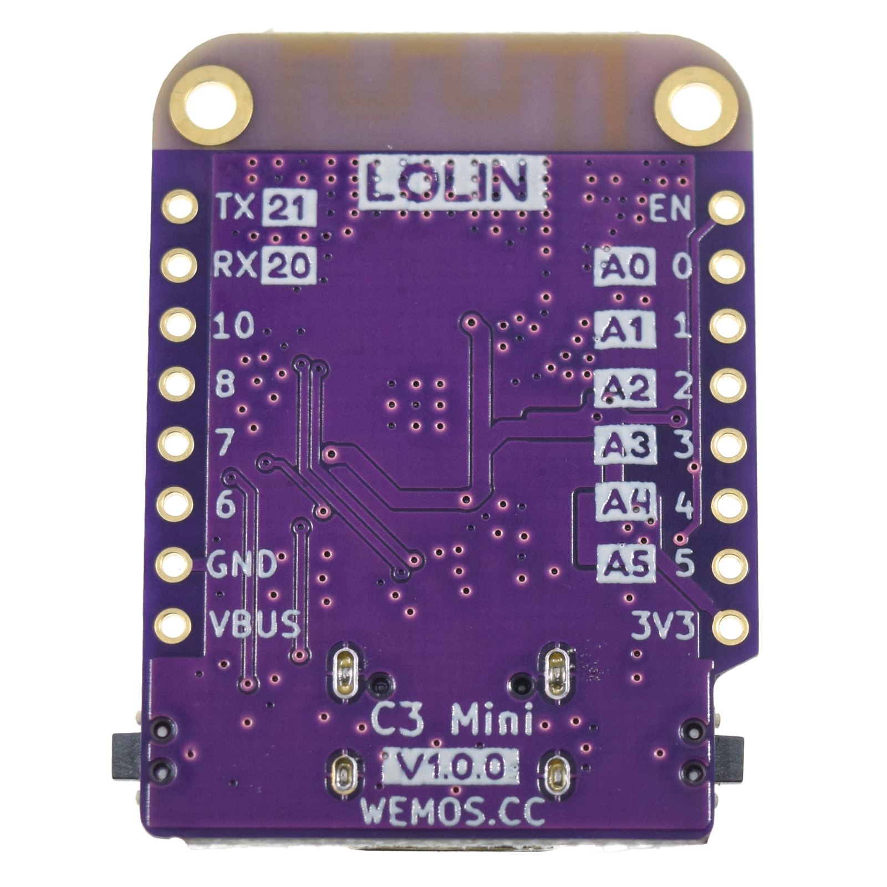
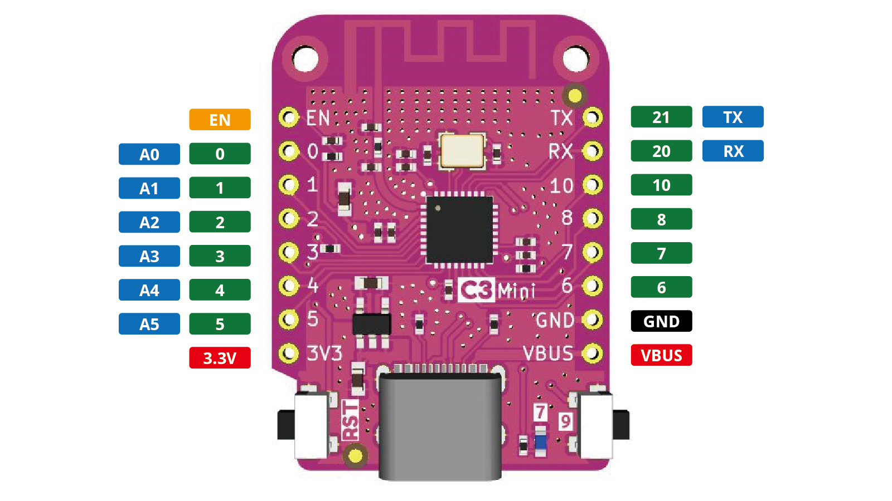

C3 mini
================

==================  ==================  
 |TOP_IMG|_           |BOTTOM_IMG|_  
==================  ==================

.. |TOP_IMG| image:: ../_static/boards/c3_mini_v1.0.0_1_16x16.jpg
.. _TOP_IMG: ../_static/boards/c3_mini_v1.0.0_1_16x16.jpg

.. _BOTTOM_IMG: ../_static/boards/c3_mini_v1.0.0_2_16x16.jpg

A mini wifi & Bluetooth5 (LE) boards based ESP32-C3FH4. 
`[Buy it]`_

.. _[Buy it]: https://www.aliexpress.com/item/1005004005736554.html

Features
------------------
* based ESP32-C3 WIFI & Bluetooth LE RISC-V Single-Core CPU
* Type-C USB
* 4MB Flash
* 12x IO
* ADC, I2C, SPI, UART
* Compatible with LOLIN D1 mini shields 
* Compatible with MicroPython, Arduino and ESP-IDF
* Default firmware: MicroPython

Tutorials
----------------------

* :doc:`../tutorials/c3/get_started_with_micropython_c3`
* :doc:`../tutorials/c3/get_started_with_arduino_c3`

Documentation
----------------------

* `Schematic V1.0.0[PDF] <../_static/files/sch_c3_mini_v1.0.0.pdf>`_
* `Dimension V1.0.0[PDF] <../_static/files/dim_c3_mini_v1.0.0.pdf>`_
* `ESP32-C3 Datasheet <https://www.espressif.com/sites/default/files/documentation/esp32-c3_datasheet_en.pdf>`_

About WIFI
----------------------
You need set WIFI Tx Power to 8.5dBm to use WIFI.

More:

* `Arduino <../tutorials/c3/get_started_with_arduino_c3.html#wifi>`_

Technical specs
----------------------

+----------------------+------------+
| Operating Voltage    | 3.3V       |
+----------------------+------------+
| Digital I/O Pins     | 12         |
+----------------------+------------+
| Clock Speed          | 160MHz     |
+----------------------+------------+
| Flash                | 4M Bytes   |
+----------------------+------------+
| Size                 | 34.3*25.4mm|
+----------------------+------------+
| Weight               | 2.4g       |
+----------------------+------------+

Pin
----------------------

