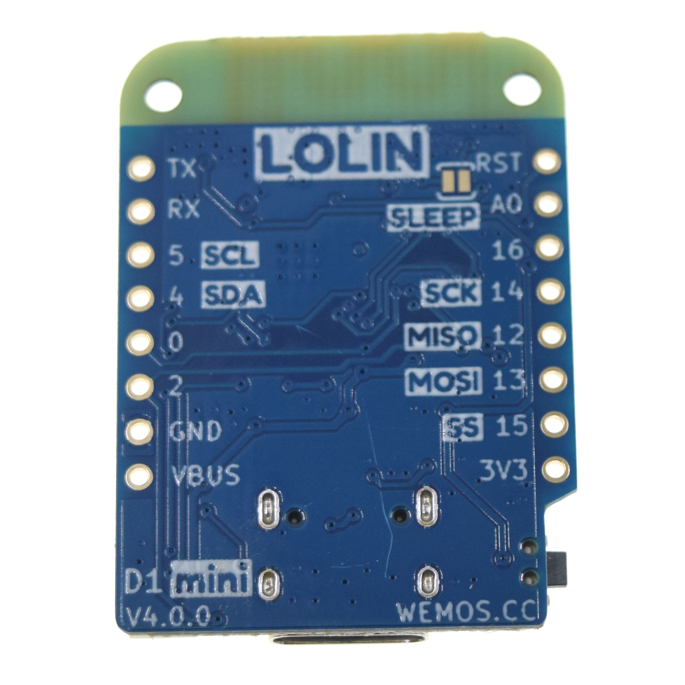
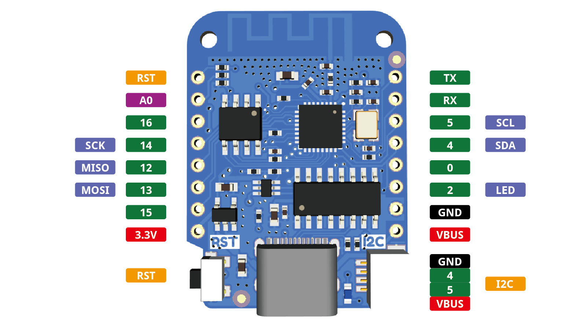

LOLIN D1 mini
=====================

==================  ==================  
 |TOP_IMG|_           |BOTTOM_IMG|_  
==================  ==================

.. |TOP_IMG| image:: ../_static/boards/d1_mini_v4.0.0_1_16x16.png
.. _TOP_IMG: ../_static/boards/d1_mini_v4.0.0_1_16x16.png

.. _BOTTOM_IMG: ../_static/boards/d1_mini_v4.0.0_2_16x16.png

.. .. raw:: html

..     

..     <iframe width="100%" height="350" src="https://www.youtube.com/embed/oJsUvBQyHBs?rel=0" frameborder="0" allow="autoplay; encrypted-media" allowfullscreen></iframe>
..     

A mini wifi board with 4MB flash based on ESP-8266EX.
`[Buy it] <https://www.aliexpress.com/item/32529101036.html>`_

Features
------------------

  * 11 digital IO, interrupt/pwm/I2C/one-wire supported(except D0)
  * 1 analog input(3.2V max input)
  * Type-C USB Port
  * LOLIN I2C Port
  * Compatible with MicroPython, Arduino, nodemcu

Tutorials
----------------------
  * :doc:`../tutorials/d1/get_started_with_micropython_d1`
  * :doc:`../tutorials/d1/get_started_with_arduino_d1`

Documentation
----------------------
  * `Schematic V4.0.0[PDF] <../_static/files/sch_d1_mini_v4.0.0.pdf>`_
  * :doc:`../ch340_driver`

Technical specs
----------------------
+------------------------+------------+
| Operating Voltage      | 3.3V       |
+------------------------+------------+
| Digital I/O Pins       | 11         |
+------------------------+------------+
| Analog Input Pins      | 1(3.2V Max)|
+------------------------+------------+
| Clock Speed            | 80/160MHz  |
+------------------------+------------+
| Flash                  | 4M Bytes   |
+------------------------+------------+
| Size                   | 34.2*25.6mm|
+------------------------+------------+
| Weight                 | 3g         |
+------------------------+------------+

Pin
----------------------

.. note:: All of the IO pins run at 3.3V.

Version
----------------------
  * V4.0.0 (current)
  * `V3.1.0 <./d1_mini_3.1.0.html>`_
  * V3.0.0
  * V2.3.0
  * V2.2.0

