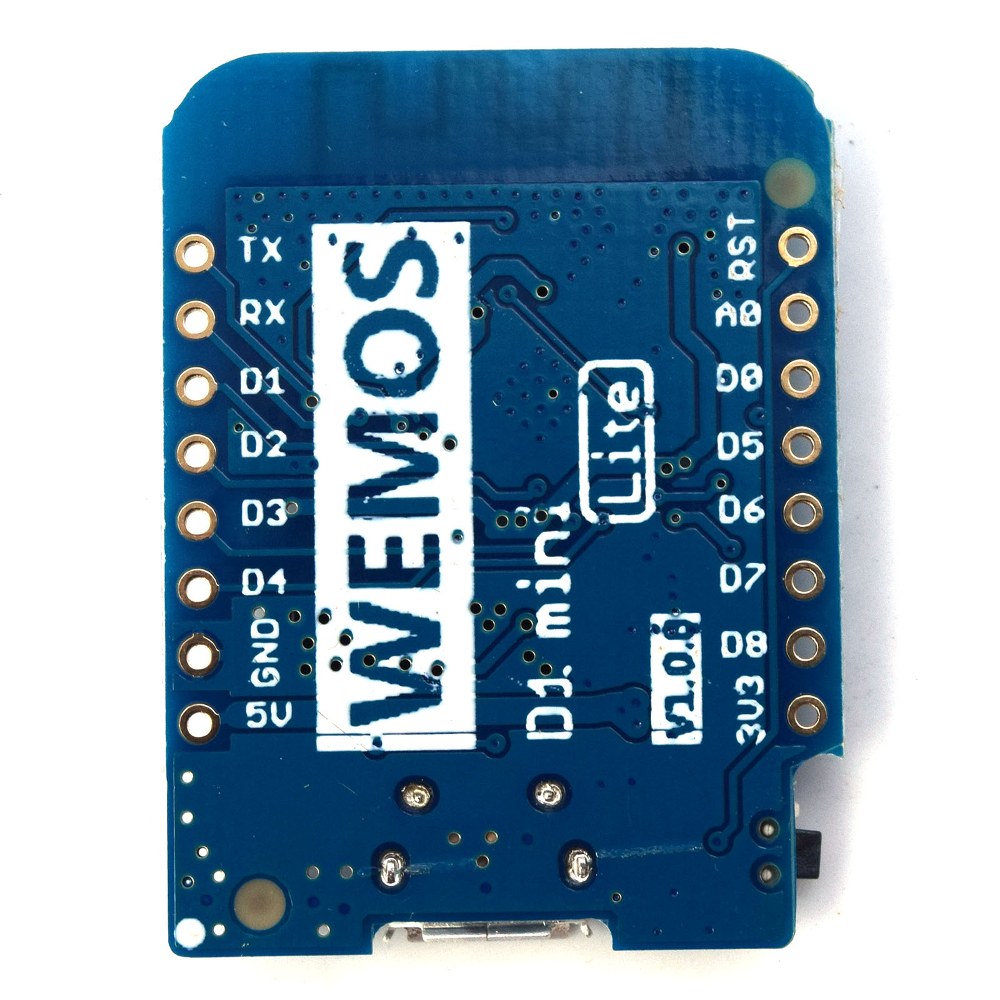

D1 mini Lite
=====================

==================  ==================  
 |TOP_IMG|_           |BOTTOM_IMG|_  
==================  ==================

.. |TOP_IMG| image:: ../_static/boards/d1_mini_lite_v1.0.0_1_16x16.jpg
.. _TOP_IMG: ../_static/boards/d1_mini_lite_v1.0.0_1_16x16.jpg

.. _BOTTOM_IMG: ../_static/boards/d1_mini_lite_v1.0.0_2_16x16.jpg

A simple wifi board with 1MB flash based on ESP-8285.
`[Buy it]`_

.. _[Buy it]: https://www.aliexpress.com/store/product/WEMOS-D1-mini-Lite-V1-0-0-WIFI-Internet-of-Things-development-board-based-ESP8285-1MB/1331105_32795857574.html

Features
------------------

  * 11 digital IO, interrupt/pwm/I2C/one-wire supported(except D0)
  * 1 analog input(3.2V max input)
  * a Micro USB connection
  * 1M Bytes FLASH inside
  * Compatible with MicroPython, Arduino, nodemcu

Tutorials
----------------------
  * :doc:`../tutorials/micropython`
  * :doc:`../tutorials/arduino`

Documentation
----------------------
  * `Schematic V1.0.0 [PDF]`_
  * :doc:`../ch340_driver`

.. _Schematic V1.0.0 [PDF]: ../_static/files/sch_d1_mini_lite_v1.0.0.pdf

Technical specs
----------------------
+------------------------+------------+
| Operating Voltage      | 3.3V       |
+------------------------+------------+
| Digital I/O Pins       | 11         |
+------------------------+------------+
| Analog Input Pins      | 1(3.2V Max)|
+------------------------+------------+
| Clock Speed            | 80/160MHz  |
+------------------------+------------+
| Flash                  | 1M Bytes   |
+------------------------+------------+
| Size                   | 34.2*25.6mm|
+------------------------+------------+
| Weight                 | 5g         |
+------------------------+------------+

Pin
----------------------
+------+------------------------------+--------------+
| Pin  | Function                     | ESP-8285 Pin |
+======+==============================+==============+
| TX   | TXD                          | TXD          |
+------+------------------------------+--------------+
| RX   | RXD                          | RXD          |
+------+------------------------------+--------------+
| A0   | Analog input, max 3.2V       | A0           |
+------+------------------------------+--------------+
| D0   | IO                           | GPIO16       |
+------+------------------------------+--------------+
| D1   | IO, SCL                      | GPIO5        |
+------+------------------------------+--------------+
| D2   | IO, SDA                      | GPIO4        |
+------+------------------------------+--------------+
| D3   | IO, 10k Pull-up              | GPIO0        |
+------+------------------------------+--------------+
| D4   | IO, 10k Pull-up, BUILTIN_LED | GPIO2        |
+------+------------------------------+--------------+
| D5   | IO, SCK                      | GPIO14       |
+------+------------------------------+--------------+
| D6   | IO, MISO                     | GPIO12       |
+------+------------------------------+--------------+
| D7   | IO, MOSI                     | GPIO13       |
+------+------------------------------+--------------+
| D8   | IO, 10k Pull-down, SS        | GPIO15       |
+------+------------------------------+--------------+
| G    | Ground                       | GND          |
+------+------------------------------+--------------+
| 5V   | 5V                           | \-           |
+------+------------------------------+--------------+
| 3V3  | 3.3V                         | 3.3V         |
+------+------------------------------+--------------+
| RST  | Reset                        | RST          |
+------+------------------------------+--------------+

.. note:: All of the IO pins run at 3.3V.

