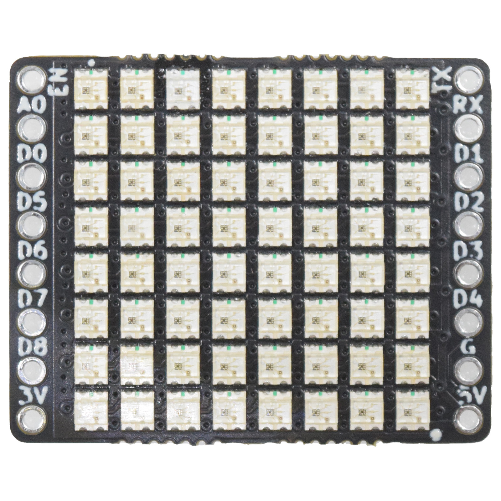
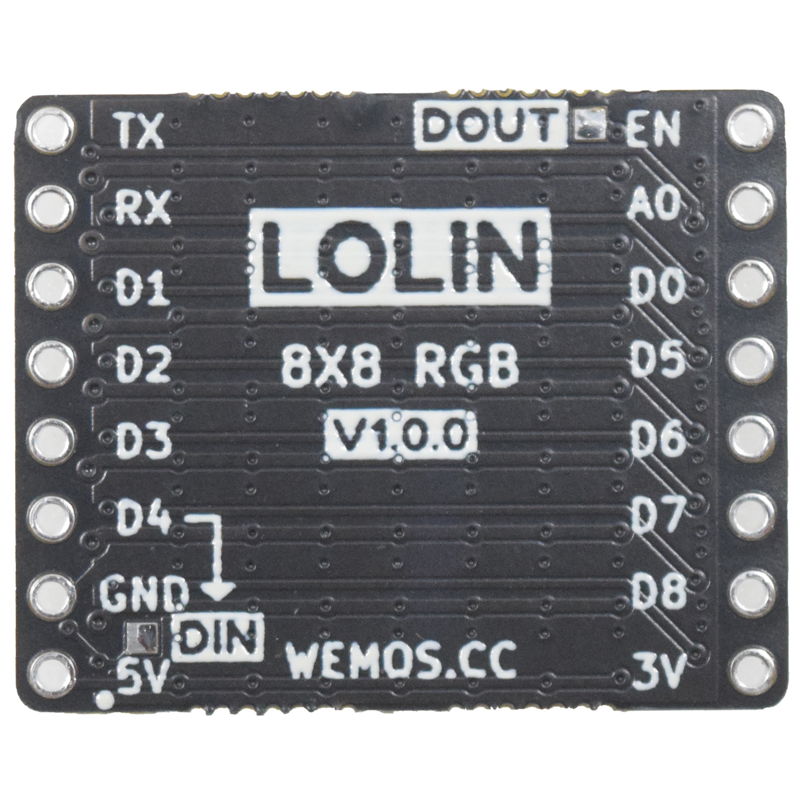
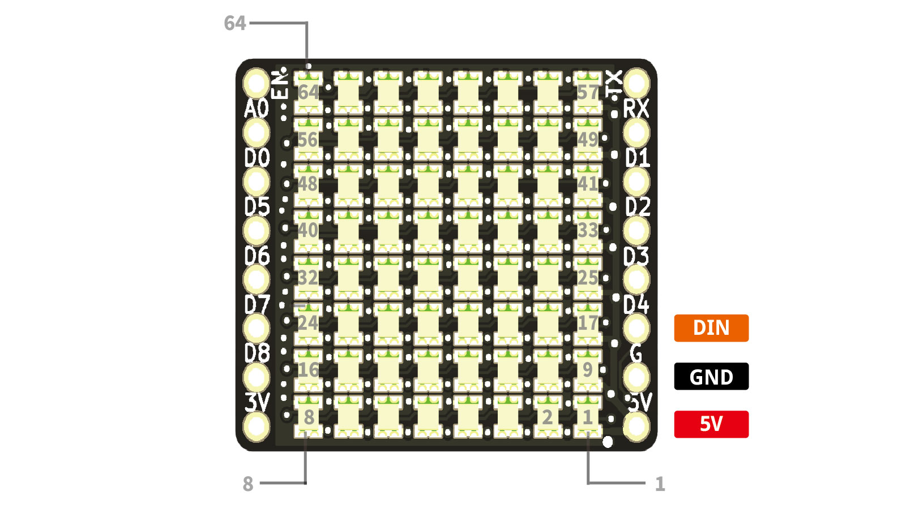

8x8 RGB Shield
===========================

==================  ==================  
 |TOP_IMG|_           |BOTTOM_IMG|_  
==================  ==================

.. _TOP_IMG: ../_static/d1_shields/8x8_rgb_v1.0.0_1_16x16.jpg

.. _BOTTOM_IMG: ../_static/d1_shields/8x8_rgb_v1.0.0_2_16x16.jpg

64 (8x8) RGB LEDs (WS2812B-2020) shield.
`[Buy it]`_

.. _[Buy it]: https://www.aliexpress.com/

Features
---------------------

  * 8x8 RGB LEDs (WS2812B-2020)
  * DIN: D4

Pin
----------------------

Documents
-----------------------

  * `Schematic v1.0.0 [PDF]`_

.. _Schematic v1.0.0 [PDF]: ../_static/files/sch_8x8_rgb_v1.0.0.pdf

Arduino
------------------------

  * `Arduino Examples`_

.. _Arduino Examples: https://github.com/wemos/D1_mini_Examples/tree/master/examples/04.Shields/8X8_RGB_Shield/

   

