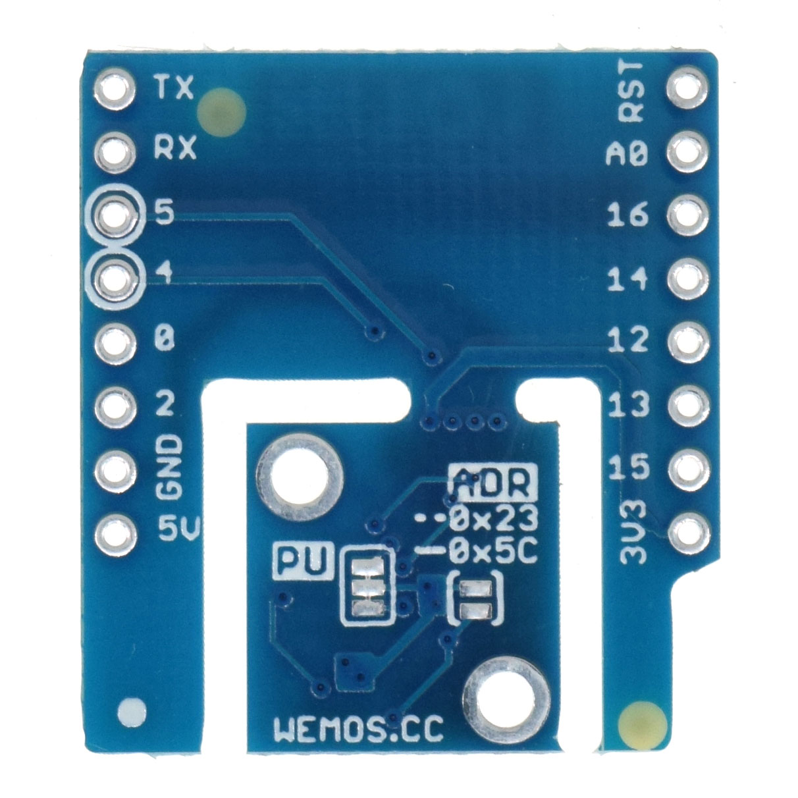

Ambient light Shield (BH1750)
================================

==================  ==================  
 |TOP_IMG|_           |BOTTOM_IMG|_  
==================  ==================

.. |TOP_IMG| image:: ../_static/d1_shields/bh1750_v1.0.0_1_16x16.jpg
.. _TOP_IMG: ../_static/d1_shields/bh1750_v1.0.0_1_16x16.jpg

.. _BOTTOM_IMG: ../_static/d1_shields/bh1750_v1.0.0_2_16x16.jpg

I2C Interface digital illuminance sensor shield based BH1750FVI.
`[Buy it]`_

.. _[Buy it]: https://www.aliexpress.com/store/product/Ambient-light-Shield-V1-0-0-for-LOLIN-D1-mini-BH1750-BH1750FVI-I2C-digital-light-sensor/1331105_32885969140.html

Features
---------------------

  * I2C Interface
  * Two user selectable addresses
  * BH1750FVI Illuminance to Digital Converter
  * Wide range and High resolution. ( 1 - 65535 lx )
  * Separable design
  * Φ2mm mounting holes

Pins
----------------------

===========    ===========    ===========
**D1 mini**    **GPIO**       **Shield**
D1             5              SCL
D2             4              SDA
===========    ===========    ===========

Documents
-----------------------

  * `Schematic v1.0.0 [PDF]`_
  * `Dimension v1.0.0 [JPG]`_
  * `BH1750FVI Datasheet [PDF]`_

.. _Schematic v1.0.0 [PDF]: ../_static/files/sch_bh1750_v1.0.0.pdf
.. _Dimension v1.0.0 [JPG]: ../_static/files/dim_bh1750_v1.0.0.jpg
.. _BH1750FVI Datasheet [PDF]: ../_static/files/bh1750fvi-tr.pdf

Arduino
------------------------

  * Install `BH1750 Library`_
  * `Arduino Examples`_

.. _BH1750 Library: https://github.com/claws/BH1750
.. _Arduino Examples: https://github.com/wemos/D1_mini_Examples/tree/master/examples/04.Shields/Ambient_Light_Shield(BH1750)

   

