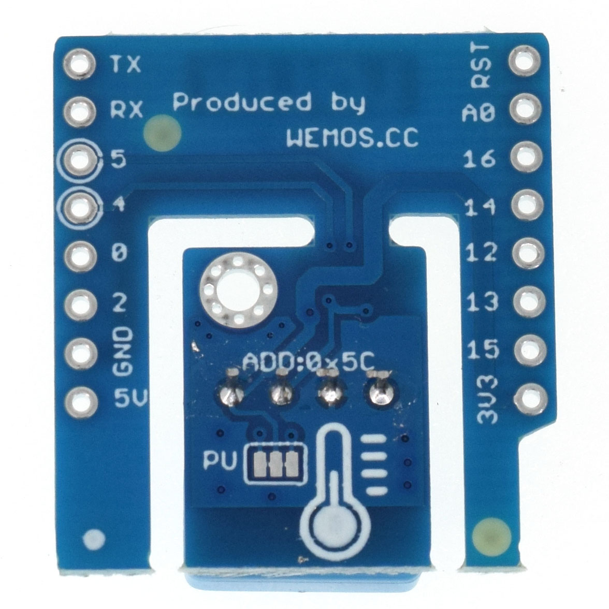

DHT Shield
===========================

==================  ==================  
 |TOP_IMG|_           |BOTTOM_IMG|_  
==================  ==================

.. |TOP_IMG| image:: ../_static/d1_shields/dht_v3.0.0_1_16x16.jpg
.. _TOP_IMG: ../_static/d1_shields/dht_v3.0.0_1_16x16.jpg

.. _BOTTOM_IMG: ../_static/d1_shields/dht_v3.0.0_2_16x16.jpg

a digital temperature and humidity sensor shield based DHT12.
`[Buy it]`_

.. _[Buy it]: http://www.aliexpress.com/store/product/DHT-Shield-for-WeMos-D1-mini-DHT11-Single-bus-digital-temperature-and-humidity-sensor-module-sensor/1331105_32534235492.html

Features
---------------------

  * Temperature: -20~60°C (±0.5°C)
  * Humidity: 20-95%RH (±5%RH)

Pins
----------------------

===========    ===========    ===========
**D1 mini**    **GPIO**       **Shield**
D1             5              SCL
D2             4              SDA
===========    ===========    ===========

Documents
-----------------------

  * `Schematic v3.0.0 [PDF]`_

.. _Schematic v3.0.0 [PDF]: ../_static/files/sch_dht_v3.0.0.pdf

Arduino
------------------------

  * Install `WEMOS_DHT12_Arduino_Library`_
  * `Arduino Examples`_

.. _WEMOS_DHT12_Arduino_Library: https://github.com/wemos/WEMOS_DHT12_Arduino_Library
.. _Arduino Examples: https://github.com/wemos/WEMOS_DHT12_Arduino_Library/tree/master/examples

   

