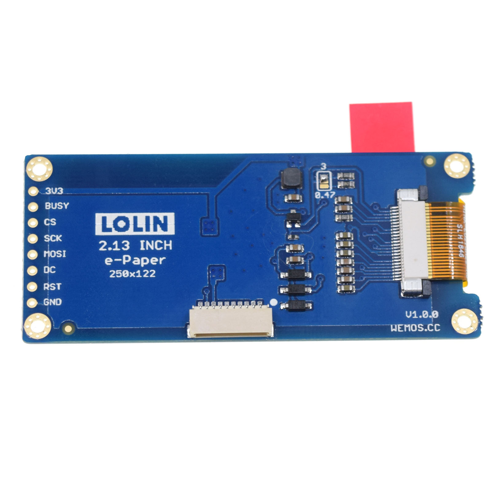

ePaper 2.13 Shield
===========================

==================  ==================  
 |TOP_IMG|_           |BOTTOM_IMG|_  
==================  ==================

.. |TOP_IMG| image:: ../_static/d1_shields/epd_2.13_v1.0.0_1_16x16.jpg
.. _TOP_IMG: ../_static/d1_shields/epd_2.13_v1.0.0_1_16x16.jpg

.. _BOTTOM_IMG: ../_static/d1_shields/epd_2.13_v1.0.0_2_16x16.jpg

2.13“ inch 250×122 ePaper/eInk display shield.
`[Buy it]`_

.. _[Buy it]: https://www.aliexpress.com/store/product/ePaper-2-13-Shield-V1-0-0-for-LOLIN-WEMOS-D1-mini-D32-2-13-inch/1331105_32981318996.html

Features
---------------------

  * 2.13" diagonal ePaper/eInk display
  * 250x122 pixels
  * Driver IC: IL3897
  * Compatible with D1 mini, D1 mini Pro, D32 Pro.

Documents
-----------------------

  * `Schematic v1.0.0 [PDF]`_
  * `Dimension v1.0.0 [JPG]`_

.. _Schematic v1.0.0 [PDF]: ../_static/files/sch_epd_2.13_v1.0.0.pdf
.. _Dimension v1.0.0 [JPG]: ../_static/files/epd_2.13_v1.0.0_4_16x9.jpg

Arduino
------------------------

  * Setup latest `LOLIN_EPD`_ , `Adafruit_GFX`_ and `Adafruit_BusIO`_ Library.
  * `Arduino Examples`_

.. _LOLIN_EPD: https://github.com/wemos/LOLIN_EPD_Library
.. _Adafruit_GFX: https://github.com/adafruit/Adafruit-GFX-Library
.. _Arduino Examples: https://github.com/wemos/LOLIN_EPD_Library/tree/master/examples
.. _Adafruit_BusIO: https://github.com/adafruit/Adafruit_BusIO

   

