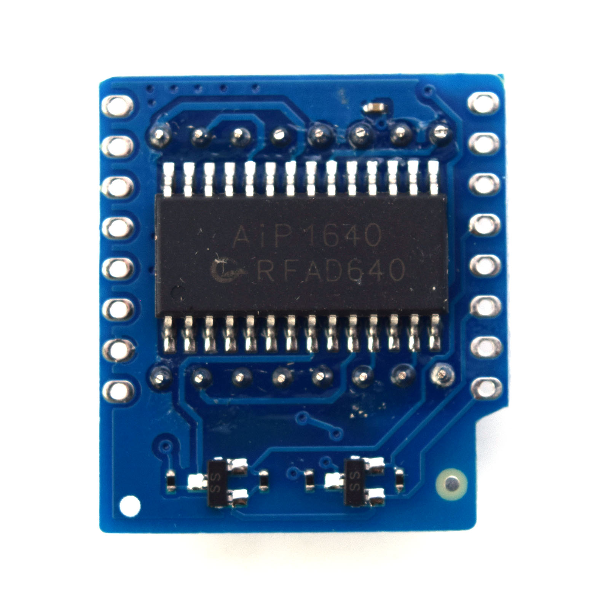

Matrix LED Shield
===========================

==================  ==================  
 |TOP_IMG|_           |BOTTOM_IMG|_  
==================  ==================

.. |TOP_IMG| image:: ../_static/d1_shields/matrix_led_v1.0.0_1_16x16.jpg
.. _TOP_IMG: ../_static/d1_shields/matrix_led_v1.0.0_1_16x16.jpg

.. _BOTTOM_IMG: ../_static/d1_shields/matrix_led_v1.0.0_2_16x16.jpg

8x8 Matrix LED 
`[Buy it]`_

.. _[Buy it]: https://www.aliexpress.com/store/product/Matrix-LED-Shield-V1-0-0-for-WEMOS-D1-mini/1331105_32812932291.html

Features
---------------------

  * 8×8 dot matrix LED
  * 8 step adjustable intensity

Pins
----------------------

===========    ===========    ===========
**D1 mini**    **GPIO**       **Shield**
D5             14             CLK
D7             13             DIN
===========    ===========    ===========

Documents
-----------------------

  * `Schematic v1.0.0 [PDF]`_

.. _Schematic v1.0.0 [PDF]: ../_static/files/sch_matrix_led_v1.0.0.pdf

Arduino
------------------------

  * Install `Matrix LED Shield Arduino Library`_
  * `Arduino Examples`_

.. _Matrix LED Shield Arduino Library: https://github.com/wemos/WEMOS_Matrix_LED_Shield_Arduino_Library
.. _Arduino Examples: https://github.com/wemos/WEMOS_Matrix_LED_Shield_Arduino_Library/tree/master/examples

   

