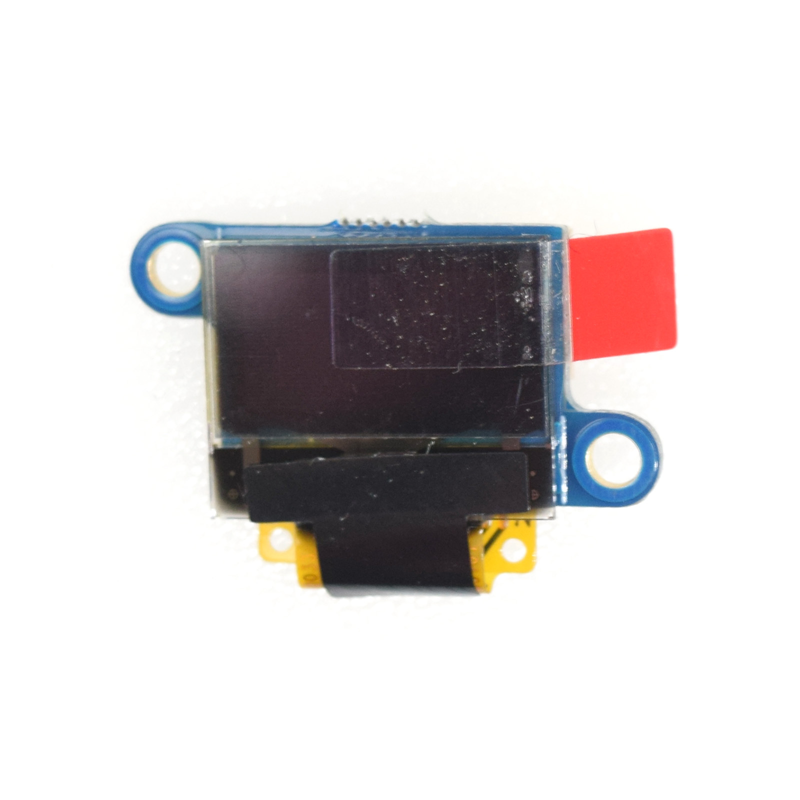
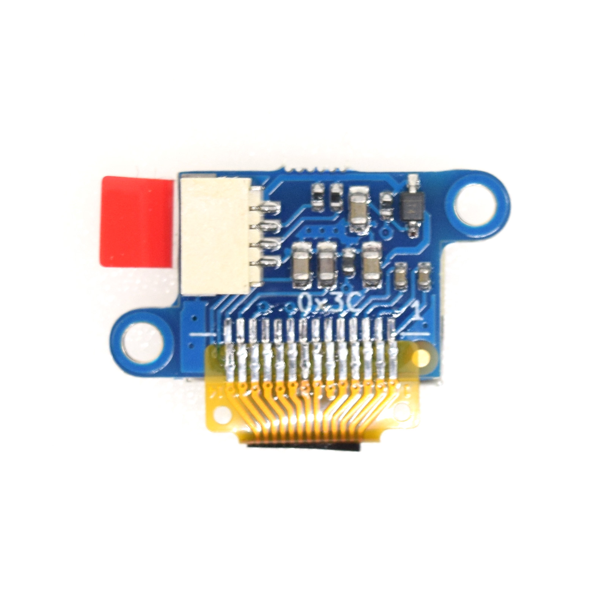

OLED 0.49 Shield
===========================

==================  ==================  
 |TOP_IMG|_           |BOTTOM_IMG|_  
==================  ==================

.. _TOP_IMG: ../_static/d1_shields/oled_0.49_v1.0.0_16x16_1.jpg

.. _BOTTOM_IMG: ../_static/d1_shields/oled_0.49_v1.0.0_16x16_2.jpg

64x32 pixels (0.49” Across) OLED Shield
`[Buy it]`_

.. _[Buy it]: https://www.aliexpress.com/item/1005002286803031.html

Features
---------------------

  * **Screen Size:** 64x32 pixels (0.49” Across)
  * **Operating Voltage:** 3.3V
  * **Driver IC:** SSD1306 (I2C Address: 0x3C)

Pins
-----------------------

LOLIN I2C Port

Documents
-----------------------

  * `Schematic v1.0.0 [PDF]`_
  * `Dimension v1.0.0 [JPG]`_

.. _Schematic v1.0.0 [PDF]: ../_static/files/sch_oled_0.49_v1.0.0.pdf
.. _Dimension v1.0.0 [JPG]: ../_static/files/dim_oled_0.49_v1.0.0.jpg

Arduino
------------------------

  * Install `esp8266-oled-ssd1306`_ Library
  * `Arduino Examples`_

.. _esp8266-oled-ssd1306: https://github.com/wemos/esp8266-oled-ssd1306
.. _Arduino Examples: https://github.com/wemos/D1_mini_Examples/tree/master/examples/04.Shields/OLED_0.49_Shield

   

