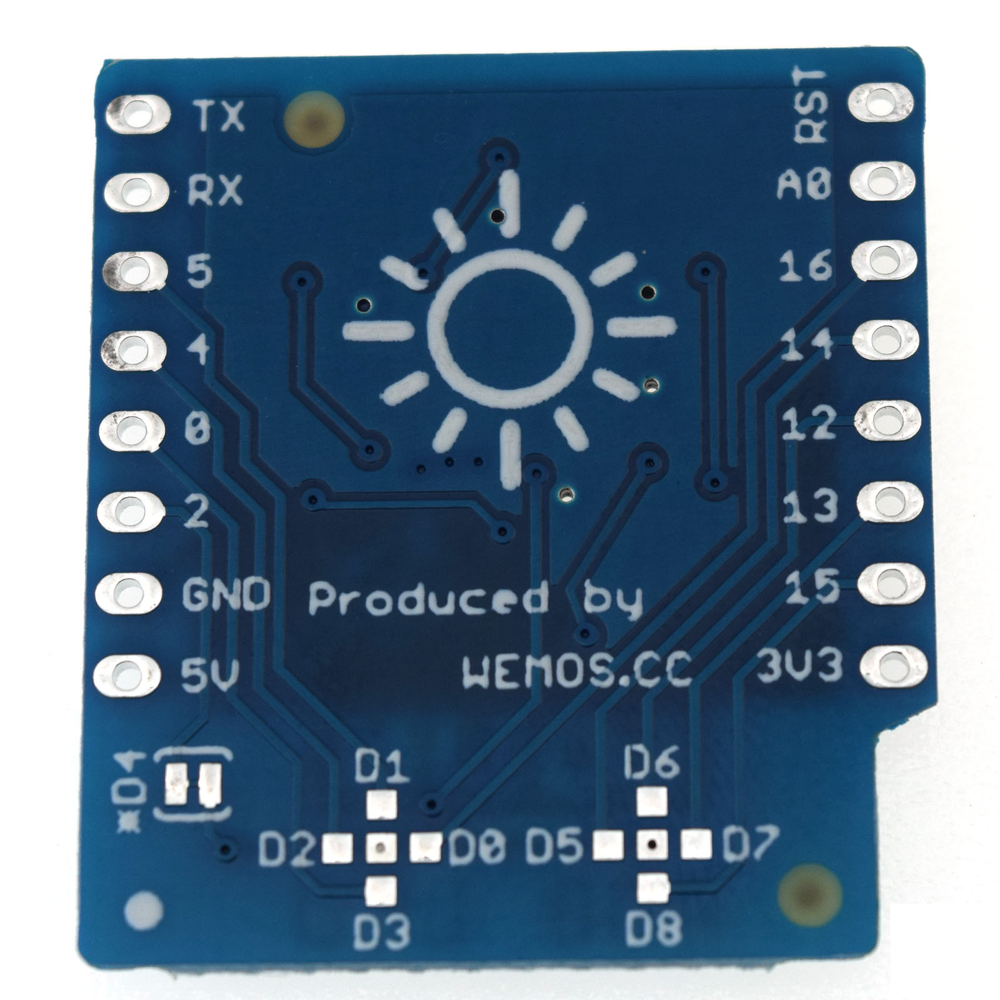

RGB LED Shield
===========================

==================  ==================  
 |TOP_IMG|_           |BOTTOM_IMG|_  
==================  ==================

.. |TOP_IMG| image:: ../_static/d1_shields/rgb_led_v1.0.0_1_16x16.jpg
.. _TOP_IMG: ../_static/d1_shields/rgb_led_v1.0.0_1_16x16.jpg

.. _BOTTOM_IMG: ../_static/d1_shields/rgb_led_v1.0.0_2_16x16.jpg

7 RGB LEDs (WS2812B-3535) shield.
`[Buy it]`_

.. _[Buy it]: https://www.aliexpress.com/store/product/RGB-LED-Shield-V1-0-0-for-LOLIN-WEMOS-D1-mini-WS2812B-3535/1331105_32869221234.html

Features
---------------------

  * 7 RGB LEDs (WS2812B-mini) each wtih 24-bit RGB color
  * 9 optional control pins, Default: D4(GPIO2)

Documents
-----------------------

  * `Schematic v1.0.0 [PDF]`_

.. _Schematic v1.0.0 [PDF]: ../_static/files/sch_rgb_led_v1.0.0.pdf

Arduino
------------------------

  * `Arduino Examples`_

.. _Arduino Examples: https://github.com/wemos/D1_mini_Examples/tree/master/examples/04.Shields/RGB_LED_Shield/

   

