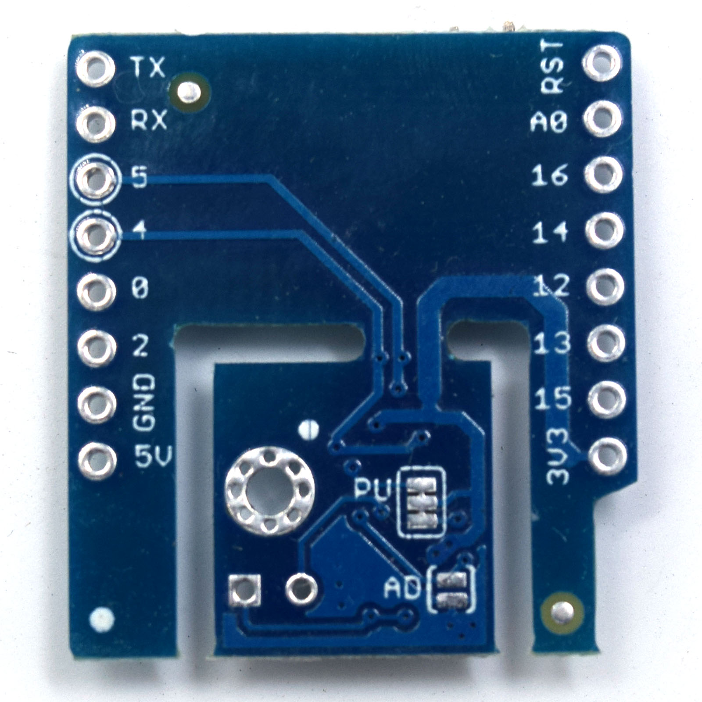

SHT30 Shield
===========================

==================  ==================  
 |TOP_IMG|_           |BOTTOM_IMG|_  
==================  ==================

.. |TOP_IMG| image:: ../_static/d1_shields/sht30_v2.1.0_1_16x16.jpg
.. _TOP_IMG: ../_static/d1_shields/sht30_v2.1.0_1_16x16.jpg

.. _BOTTOM_IMG: ../_static/d1_shields/sht30_v2.1.0_2_16x16.jpg

I2C Interface digital temperature and humidity sensor shield based SHT30.
`[Buy it]`_

.. _[Buy it]: https://www.aliexpress.com/store/product/SHT30-Shield-for-WeMos-D1-mini-SHT30-I2C-digital-temperature-and-humidity-sensor-module/1331105_32762136940.html

Features
---------------------

  * I2C Interface
  * Two user selectable addresses
  * Typical accuracy ±3%RH and ±0.3°C
  * Separable design
  * Φ2mm mounting holes

Pins
----------------------

===========    ===========    ===========
**D1 mini**    **GPIO**       **Shield**
D1             5              SCL
D2             4              SDA
===========    ===========    ===========

Documents
-----------------------

  * `Schematic v2.1.0 [PDF]`_
  * `SHT30 Datasheet [PDF]`_

.. _Schematic v2.1.0 [PDF]: ../_static/files/sch_sht30_v2.1.0.pdf
.. _SHT30 Datasheet [PDF]: ../_static/files/sht30-dis_datasheet.pdf

Arduino
------------------------

  * Install `WEMOS_SHT3x_Arduino_Library`_
  * `Arduino Examples`_

.. _WEMOS_SHT3x_Arduino_Library: https://github.com/wemos/WEMOS_SHT3x_Arduino_Library
.. _Arduino Examples: https://github.com/wemos/WEMOS_SHT3x_Arduino_Library/tree/master/examples

   

