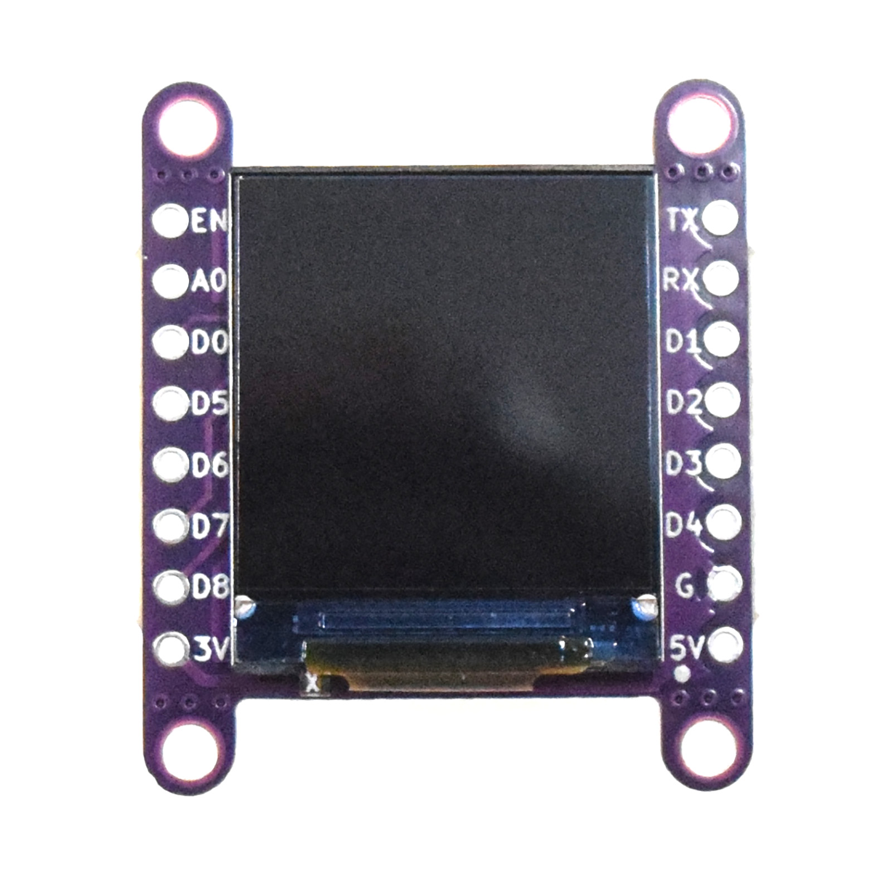
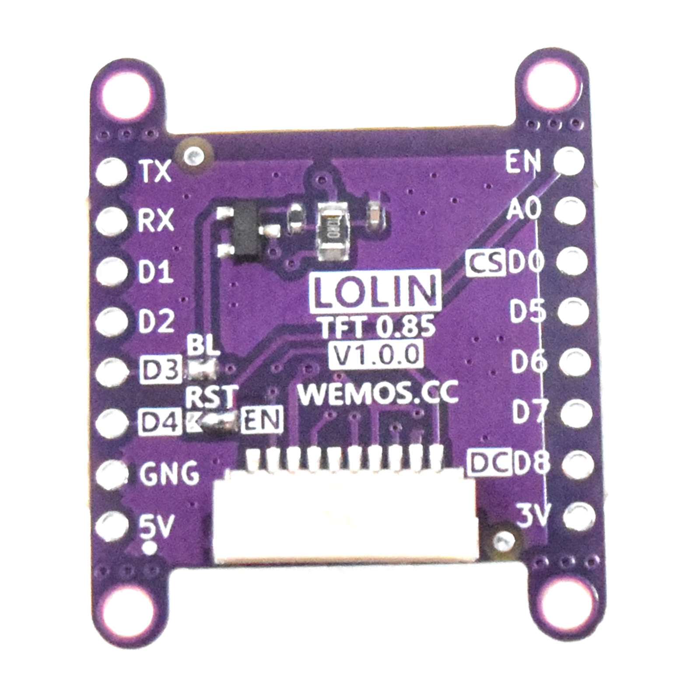

TFT 0.85 Shields
===========================

==================  ==================  
 |TOP_IMG|_           |BOTTOM_IMG|_  
==================  ==================

.. _TOP_IMG: ../_static/d1_shields/tft_0.85_v1.0.0_1_16x16.jpg

.. _BOTTOM_IMG: ../_static/d1_shields/tft_0.85_v1.0.0_2_16x16.jpg

0.85 inch 128×128 TFT LCD Screen shield.
`[Buy it]`_

.. _[Buy it]: https://www.aliexpress.com/item/3256806652745137.html

Features
---------------------

  * 0.85" diagonal LCD TFT display
  * 128x128 pixels
  * TFT Driver IC: GC9107 (GC9A01 compatible)
  * 1x LOLIN TFT Port

Pins
---------------------

=====================   =================    =================    =================    =================
**Shield**               **D1 mini**         **C3 mini/pico**     **S2 mini**          **S3 mini**
TFT_BL(ON/D3*)           ON / IO0*           ON / IO7*            ON / IO18*           ON / IO18*           
TFT_RST(EN*/D4)          EN* / IO2           EN* / IO6            EN* / IO16           EN* / IO16 
TFT_DC(D8)               IO15                IO5                  IO12                 IO10
MOSI(D7)                 IO13                IO4                  IO11                 IO11
MISO(D6)                 IO12                IO0                  IO9                  IO13 
SCK(D5)                  IO14                IO1                  IO7                  IO12
TFT_CS(D0)               IO16                IO2                  IO5                  IO4
=====================   =================    =================    =================    =================

*\* - default*

Documents
-----------------------

  * `Schematic v1.0.0 [PDF]`_
  * `Dimension v1.0.0 [JPG]`_

.. _Schematic v1.0.0 [PDF]: ../_static/files/sch_tft_0.85_v1.0.0.pdf
.. _Dimension v1.0.0 [JPG]: ../_static/files/dim_tft_0.85_v1.0.0.pdf

Arduino
------------------------

  * Setup latest `wemos/TFT_eSPI`_ Library
  * find *User_Setup_Select.h* file in <TFT_eSPI> dir
  * commented *#include <User_Setup.h>* in *User_Setup_Select.h* 
  * uncommented your correct board, for examples: for d1 mini boards, uncommented *#include <User_Setups/Setup400_LOLIN_TFT085_D1_MINI.h>*   in *User_Setup_Select.h* 
  * `Arduino Examples`_

.. _wemos/TFT_eSPI: https://github.com/wemos/TFT_eSPI

.. _Arduino Examples: https://github.com/wemos/TFT_eSPI/tree/master/examples

   

