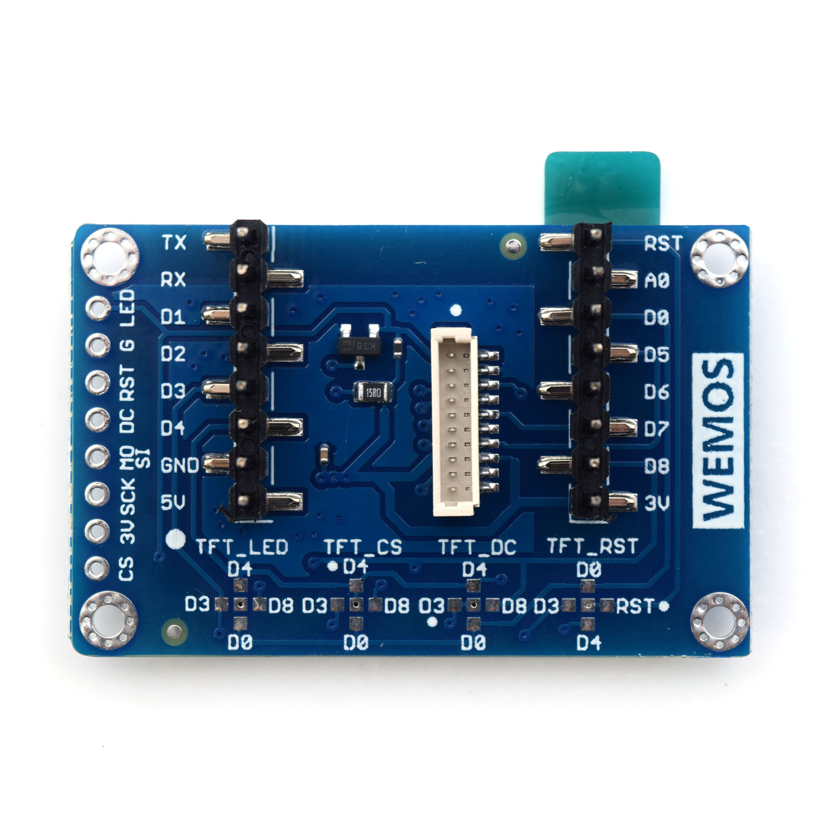

TFT 1.4 Shield
===========================

==================  ==================  
 |TOP_IMG|_           |BOTTOM_IMG|_  
==================  ==================

.. |TOP_IMG| image:: ../_static/d1_shields/tft_1.44_v1.0.0_1_16x16.jpg
.. _TOP_IMG: ../_static/d1_shields/tft_1.44_v1.0.0_1_16x16.jpg

.. _BOTTOM_IMG: ../_static/d1_shields/tft_1.44_v1.0.0_2_16x16.jpg

1.44“ inch TFT LCD shield.
`[Buy it]`_

.. _[Buy it]: https://www.aliexpress.com/store/product/TFT-1-4-Shield-V1-0-0-for-WeMos-D1-mini-1-44-inch-128X128-SPI/1331105_32848274716.html

Features
---------------------

  * 1.44" diagonal LCD TFT display
  * 128x128 resolution, 18-bit (262,144) color
  * Driver IC: ST7735S
  * Compatible with WEMOS D1 mini
  * 3 kinds of connection

Pins
---------------------

=================    =================    =================
**D1 mini**          **GPIO**             **Shield**
RST*(D0/D3/D4)       RST*(16/0/2)         TFT_RST
D3*(D0/D4/D8)        0*(16/2/15)          TFT_DC
D4*(D0/D3/D8)        2*(16/0/15)          TFT_CS
D7                   13                   MOSI
D5                   14                   SCK
NC*(D0/D3/D4/D8)     NC*(16/0/2/15)       TFT_LED
=================    =================    =================

*\* - default*

Documents
-----------------------

  * `Schematic v1.0.0 [PDF]`_
  * `Dimension v1.0.0 [JPG]`_

.. _Schematic v1.0.0 [PDF]: ../_static/files/sch_tft1.4_v1.0.0.pdf
.. _Dimension v1.0.0 [JPG]: ../_static/files/tft_1.44_v1.0.0_8_16x9.jpg

Arduino
------------------------

  * Setup `Adafruit_GFX`_ and `Adafruit_ST7735`_ library
  * `Arduino Examples`_

.. _Adafruit_GFX: https://github.com/adafruit/Adafruit-GFX-Library
.. _Adafruit_ST7735: https://github.com/adafruit/Adafruit-ST7735-Library
.. _Arduino Examples: https://github.com/wemos/D1_mini_Examples/tree/master/examples/04.Shields/TFT_1.4_Shield

   

