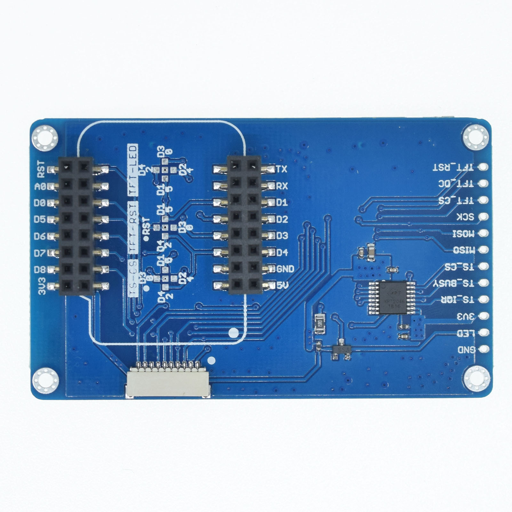

TFT 2.4 Touch Shields
===========================

==================  ==================  
 |TOP_IMG|_           |BOTTOM_IMG|_  
==================  ==================

.. |TOP_IMG| image:: ../_static/d1_shields/tft_2.4_v1.0.0_1_16x16.jpg
.. _TOP_IMG: ../_static/d1_shields/tft_2.4_v1.0.0_1_16x16.jpg

.. _BOTTOM_IMG: ../_static/d1_shields/tft_2.4_v1.0.0_2_16x16.jpg

2.4“ inch 320×240 TFT LCD Touch Screen shield.
`[Buy it]`_

.. _[Buy it]: https://www.aliexpress.com/store/product/TFT-2-4-Touch-Shield-V1-0-0-for-LOLIN-WEMOS-D1-mini-2-4-inch/1331105_32919729730.html

Features
---------------------

  * 2.4" diagonal LCD TFT display
  * 320X240 pixels
  * TFT Driver IC: ILI9341
  * Touch Screen controller IC: XPT2046
  * Compatible with D1 mini, D1 mini Pro, D32 Pro.
  * 3 kinds of connection

Pins
---------------------

=================    =================    =================
**D1 mini**          **GPIO**             **Shield**
NC*(D1/D2/D3/D4)     NC*(5/4/0/2)         TFT_LED
RST*(D1/D3/D4))      RST*(5/0/2)          TFT_RST
D8                   15                   TFT_DC
D7                   13                   MOSI
D6                   12                   MISO
D5                   14                   SCK
D0                   16                   TFT_CS
D3*(D1/D2/D4)        0*(5/4/2)            TS_CS
=================    =================    =================

*\* - default*

Documents
-----------------------

  * `Schematic v1.0.0 [PDF]`_
  * `Dimension v1.0.0 [JPG]`_

.. _Schematic v1.0.0 [PDF]: ../_static/files/sch_tft2.4_v1.0.0.pdf
.. _Dimension v1.0.0 [JPG]: ../_static/files/tft_2.4_v1.0.0_5_16x9.jpg

Arduino
------------------------

  * Setup latest `Adafruit_GFX`_, `Adafruit_ILI9341`_ and `XPT2046_Touchscreen`_ Library
  * `Arduino Examples`_

.. note:: Make sure you using lastest `ESP8266 core`_ for Arduino.

.. _ESP8266 core: https://github.com/esp8266/Arduino

.. _Adafruit_GFX: https://github.com/adafruit/Adafruit-GFX-Library
.. _Adafruit_ILI9341: https://github.com/adafruit/Adafruit_ILI9341
.. _XPT2046_Touchscreen: https://github.com/PaulStoffregen/XPT2046_Touchscreen
.. _Arduino Examples: https://github.com/wemos/D1_mini_Examples/tree/master/examples/04.Shields/TFT_2.4_Touch_Shield

   

