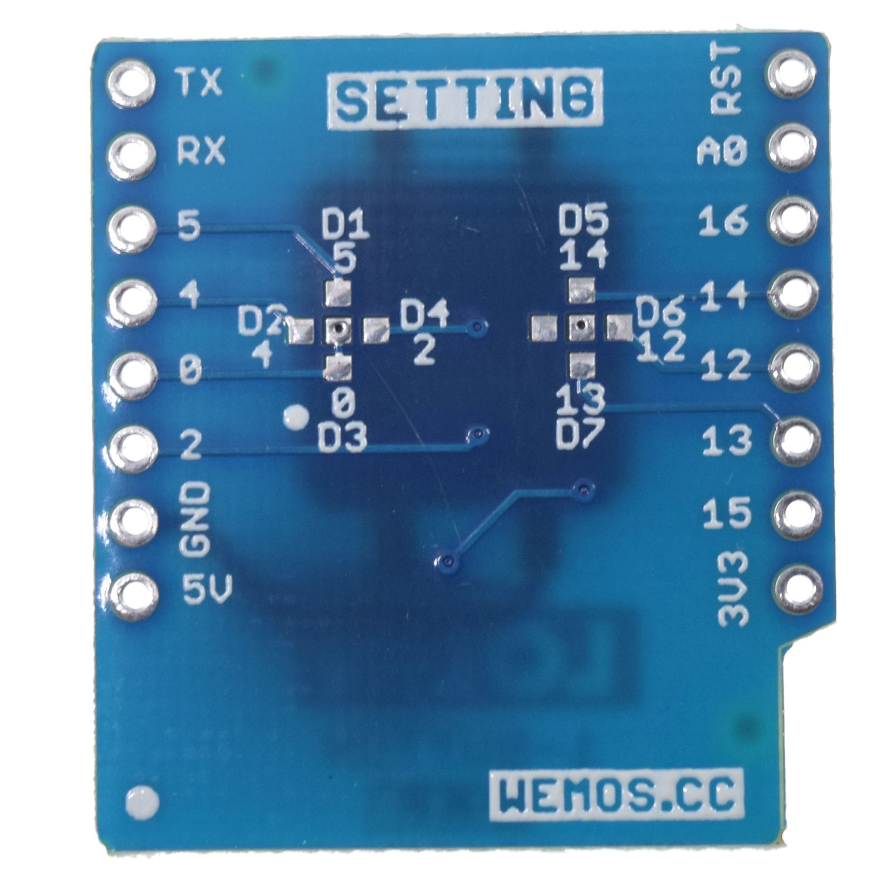

1-Button Shileds
===================

==================  ==================  
 |TOP_IMG|_           |BOTTOM_IMG|_  
==================  ==================

.. |TOP_IMG| image:: ../_static/d1_shields/button_v2.1.0_1_16x16.jpg
.. _TOP_IMG: ../_static/d1_shields/button_v2.1.0_1_16x16.jpg

.. _BOTTOM_IMG: ../_static/d1_shields/button_v2.1.0_2_16x16.jpg

A simple button shield, you can use it for 1-Button IOT application.
`[Buy it]`_

.. _[Buy it]: https://www.aliexpress.com/store/product/1-Button-Shield-for-WeMos-D1-mini-button/1331105_32575988167.html

Pins
---------------------

===========    ===========
**D1 mini**    **Shield**
D3(GPIO0)      Button
===========    ===========

Arduino Code
-----------------------

  * `Arduino example`_

.. _Arduino example: https://github.com/wemos/D1_mini_Examples/tree/master/examples/04.Shields/1_Button_Shield
   

