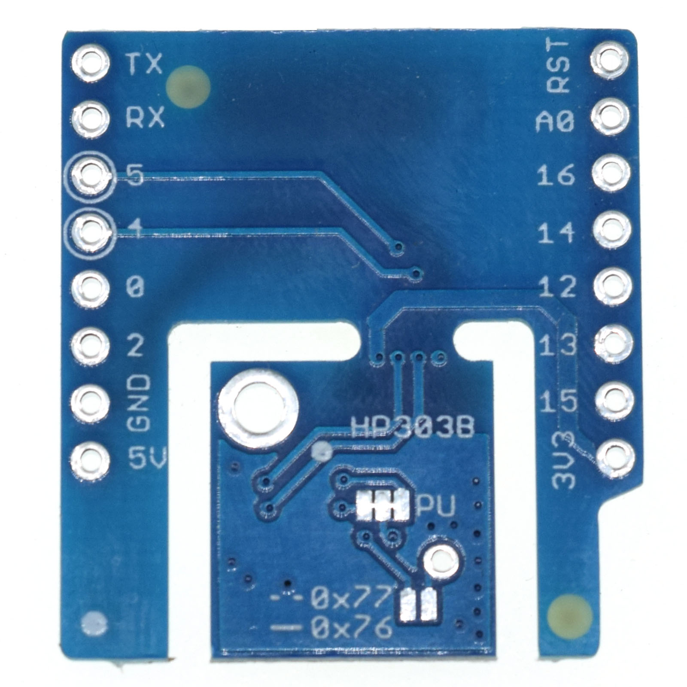

Barometric Pressure Shield (HP303B)
=========================================

==================  ==================  
 |TOP_IMG|_           |BOTTOM_IMG|_  
==================  ==================

.. |TOP_IMG| image:: ../_static/d1_shields/hp303b_v1.0.0_1_16x16.jpg
.. _TOP_IMG: ../_static/d1_shields/hp303b_v1.0.0_1_16x16.jpg

.. _BOTTOM_IMG: ../_static/d1_shields/hp303b_v1.0.0_2_16x16.jpg

I2C Barometric Pressure & Temperature shield based on HP303B.
`[Buy it]`_

.. _[Buy it]: https://www.aliexpress.com/store/product/Barometric-Pressure-Shield-V1-0-0-for-LOLIN-WEMOS-D1-mini-HP303B-I2C-digital-pressure-sensor/1331105_32947207904.html

Features
---------------------

  * I2C Interface
  * Two user selectable addresses (0x77 or 0x76)
  * Operation range: Pressure: 300 -1200 hPa. Temperature: -40 - 85 °C.
  * Pressure sensor precision: ± 0.005 hPa (or ±0.05 m) (high precision mode).
  * Relative accuracy: ± 0.06 hPa (or ±0.5 m)
  * Absolute accuracy: ± 1 hPa (or ±8 m)
  * Temperature accuracy: ± 0.5°C.
  * Separable design
  * Φ2mm mounting holes

Pins
----------------------

===========    ===========    ===========
**D1 mini**    **GPIO**       **Shield**
D1             5              SCL
D2             4              SDA
===========    ===========    ===========

Documents
-----------------------

  * `Schematic v1.0.0 [PDF]`_
  * `HP303B Datasheet [PDF]`_

.. _Schematic v1.0.0 [PDF]: ../_static/files/sch_hp303b_v1.0.0.pdf
.. _HP303B Datasheet [PDF]: ../_static/files/hp303b_datasheet.pdf

Arduino
------------------------

  * Install `LOLIN HP303B Library`_
  * `Arduino Examples`_

.. _LOLIN HP303B Library: https://github.com/wemos/LOLIN_HP303B_Library
.. _Arduino Examples: https://github.com/wemos/D1_mini_Examples/tree/master/examples/04.Shields/Barometric_Pressure_HP303B_Shield

   

