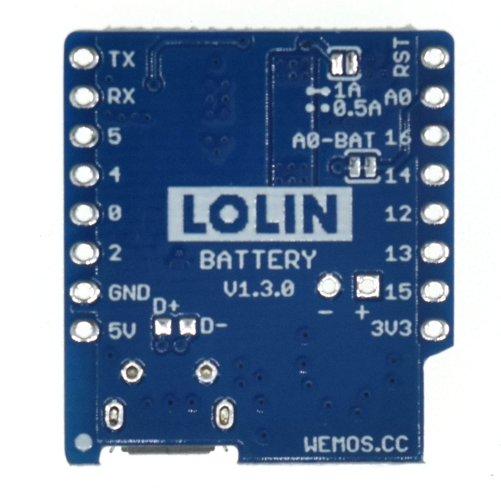

Battery Shield
===================

==================  ==================  
 |TOP_IMG|_           |BOTTOM_IMG|_  
==================  ==================

.. |TOP_IMG| image:: ../_static/d1_shields/battery_v1.3.0_1_16x16.jpg
.. _TOP_IMG: ../_static/d1_shields/battery_v1.3.0_1_16x16.jpg

.. _BOTTOM_IMG: ../_static/d1_shields/battery_v1.3.0_2_16x16.jpg

lithium (LiPo) Battery shield, charging & boost.
`[Buy it]`_

.. _[Buy it]: http://www.aliexpress.com/store/product/Battery-Shield-For-WeMos-D1-mini-single-lithium-battery-charging-boost/1331105_32679485736.html

Features
---------------------

  * Charging Voltage: max: 10V, recommend: 5V
  * Charging Current: max: 1A
  * Lithium Battery voltage: 3.3-4.2V
  * Boost Power Supply: 5V(max: 1A)

Pins
---------------------

======================    ======================
**D1 mini**               **Shield**
5V                        Power Supply, 5V(max: 1A)
GND                       GND
======================    ======================

Ports
--------------------

================================================  ================================================
PH2-2.0MM (Port 1)                                Connect to lithium Battery (normal 3.3-4.2V)
Micro USB (Port 2)                                Charging port (normal 5V)
Green LED	                                        lights when charging is completed
Red LED	                                          lights when charging
J1	                                              setting max charging current, 0.5A or 1A.
J2	                                              Connect battery to A0
================================================  ================================================

Documents
-----------------------

  * `Schematic v1.3.0 [PDF]`_

.. _Schematic v1.3.0 [PDF]: ../_static/files/sch_battery_v1.3.0.pdf

