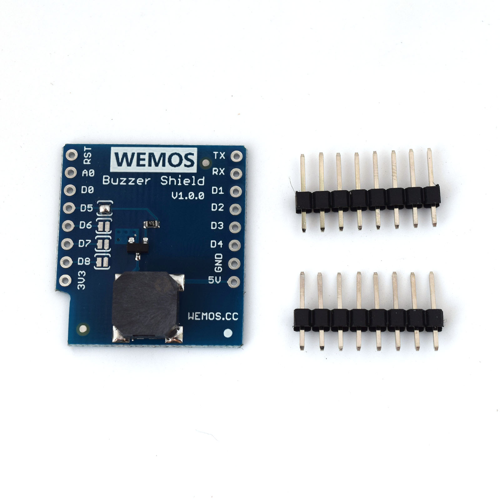

Buzzer Shield
===========================

==================  ==================  
 |TOP_IMG|_           |BOTTOM_IMG|_  
==================  ==================

.. |TOP_IMG| image:: ../_static/d1_shields/buzzer_v1.0.0_1_16x16.jpg
.. _TOP_IMG: ../_static/d1_shields/buzzer_v1.0.0_1_16x16.jpg

.. _BOTTOM_IMG: ../_static/d1_shields/buzzer_v1.0.0_2_16x16.jpg

Buzzer Shield.
`[Buy it]`_

.. _[Buy it]: https://www.aliexpress.com/store/product/Buzzer-Shield-V1-0-0-for-WEMOS-D1-mini/1331105_32811252983.html

Features
---------------------

  * Frequency: 1kHz-3kHz
  * 4 optional control ports, Default: D5(GPIO14)

Pins
----------------------

===========    ===========    ===========
**D1 mini**    **GPIO**       **Shield**
D5/D6/D7/D8    14/12/13/15    Button
===========    ===========    ===========

Documents
-----------------------

  * `Schematic v1.0.0 [PDF]`_
  * `MLT-8540 Datasheet [PDF]`_

.. _Schematic v1.0.0 [PDF]: ../_static/files/sch_buzzer_v1.0.0.pdf
.. _MLT-8540 Datasheet [PDF]: ../_static/files/mlt-8540.pdf

Arduino
------------------------

  * `Arduino Examples`_

.. _Arduino Examples: https://github.com/wemos/D1_mini_Examples/tree/master/examples/04.Shields/RGB_LED_Shield/

   

