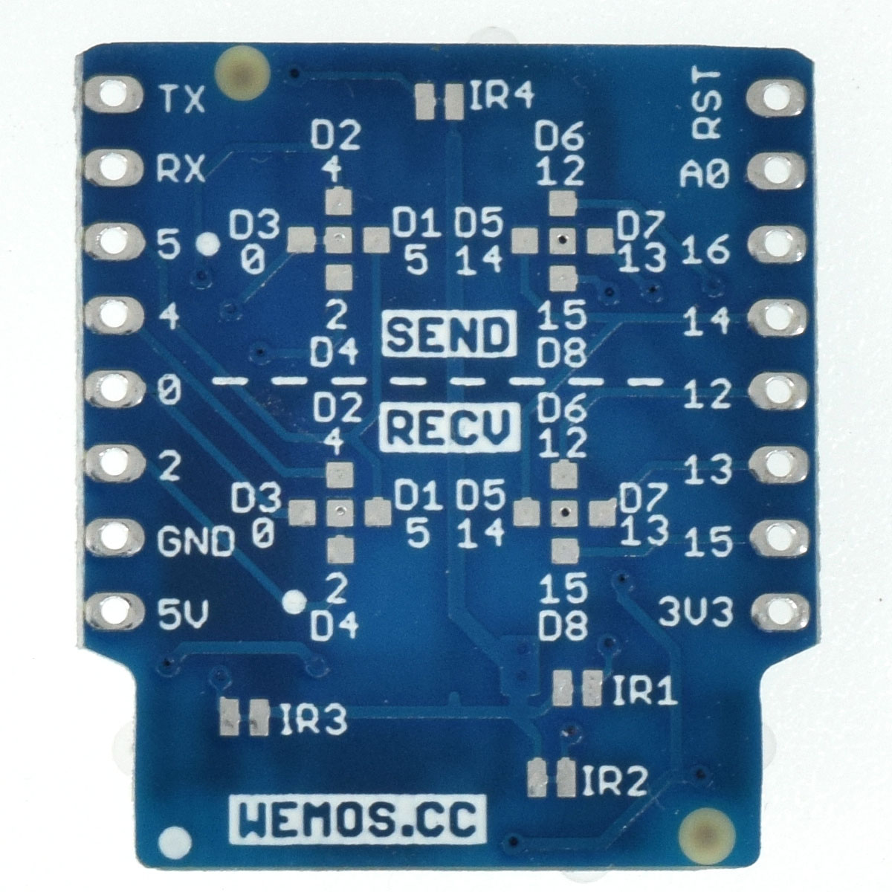

IR Controller Shield
===========================

==================  ==================  
 |TOP_IMG|_           |BOTTOM_IMG|_  
==================  ==================

.. |TOP_IMG| image:: ../_static/d1_shields/ir_v1.0.0_1_16x16.jpg
.. _TOP_IMG: ../_static/d1_shields/ir_v1.0.0_1_16x16.jpg

.. _BOTTOM_IMG: ../_static/d1_shields/ir_v1.0.0_2_16x16.jpg

IR send and recive controller shield.
`[Buy it]`_

.. _[Buy it]: https://www.aliexpress.com/store/product/IR-Controller-Shield-V1-0-0-for-LOLIN-D1-mini-Infrared-sensors-4x-940nm-emitter-1x/1331105_32891173618.html

Features
---------------------

  * 4x IR LEDs emitter (940nm)
  * 1x IR receiver (38kHz)
  * Configurable IO (Default: Sender - D3/GPIO0, Receiver - D4/GPIO2)

Pins
----------------------

===========    ===========    ===========
**D1 mini**    **GPIO**       **Shield**
D3             0              Send
D4             2              Receiver
===========    ===========    ===========

Documents
-----------------------

  * `Schematic v1.0.0 [PDF]`_
  * `IR12-21c Datasheet [PDF]`_
  * `IRM-H638T Datasheet [PDF]`_

.. _Schematic v1.0.0 [PDF]: ../_static/files/sch_ir_v1.0.0.pdf
.. _IR12-21c  Datasheet [PDF]: ../_static/files/ir12-21c_datasheet.pdf
.. _IRM-H638T Datasheet [PDF]: ../_static/files/irm-h638t_datasheet.pdf

Arduino
------------------------

  * Install `IRremote ESP8266 Library`_
  * `Arduino Examples`_

.. _IRremote ESP8266 Library: https://github.com/markszabo/IRremoteESP8266
.. _Arduino Examples: https://github.com/wemos/D1_mini_Examples/tree/master/examples/04.Shields/IR_Controller_Shield

   

