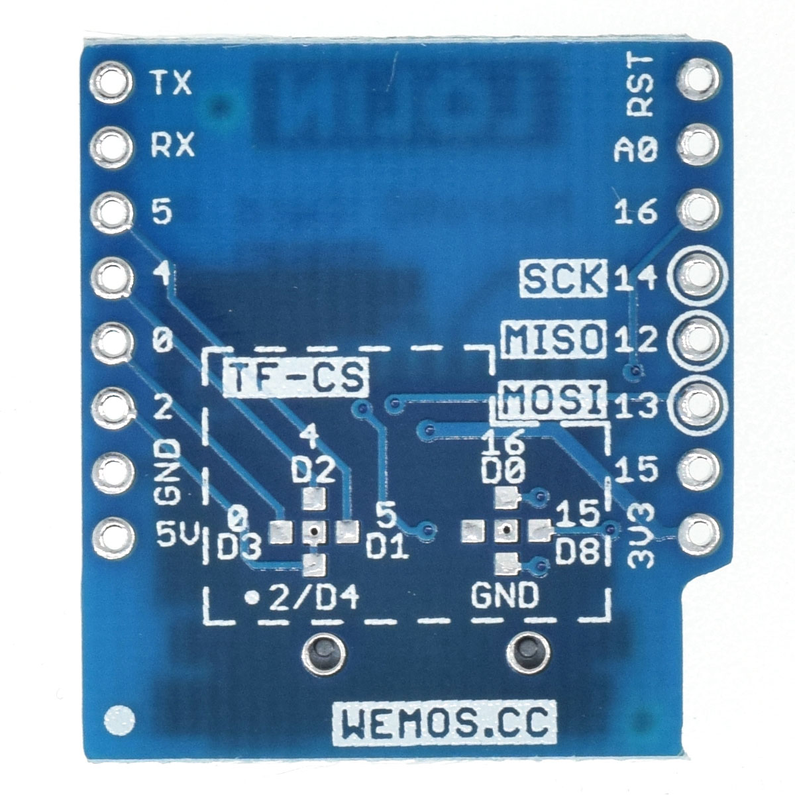

Micro SD Card Shield
===========================

==================  ==================  
 |TOP_IMG|_           |BOTTOM_IMG|_  
==================  ==================

.. |TOP_IMG| image:: ../_static/d1_shields/sd_v1.2.0_1_16x16.jpg
.. _TOP_IMG: ../_static/d1_shields/sd_v1.2.0_1_16x16.jpg

.. _BOTTOM_IMG: ../_static/d1_shields/sd_v1.2.0_2_16x16.jpg

use Micro SD(TF) card for D1 mini.
`[Buy it]`_

.. _[Buy it]: http://www.aliexpress.com/store/product/Micro-SD-Shield-for-WeMos-D1-mini-TF/1331105_32578362865.html

Features
---------------------

  * Configurable CS pin, Default: D4 (GPIO0)

Pins
----------------------

===========    ===========    ===========
**D1 mini**    **GPIO**       **Shield**
D5             14             CLK
D6             12             MISO
D7             13             MOSI
D4             0              CS
===========    ===========    ===========

Documents
-----------------------

  * `Schematic v1.2.0 [PDF]`_

.. _Schematic v1.2.0 [PDF]: ../_static/files/sch_microsd_v1.2.0.pdf

Arduino
------------------------

  * `Arduino Examples`_

.. _Arduino Examples: https://github.com/wemos/D1_mini_Examples/tree/master/examples/04.Shields/Micro_SD_Shield

   

