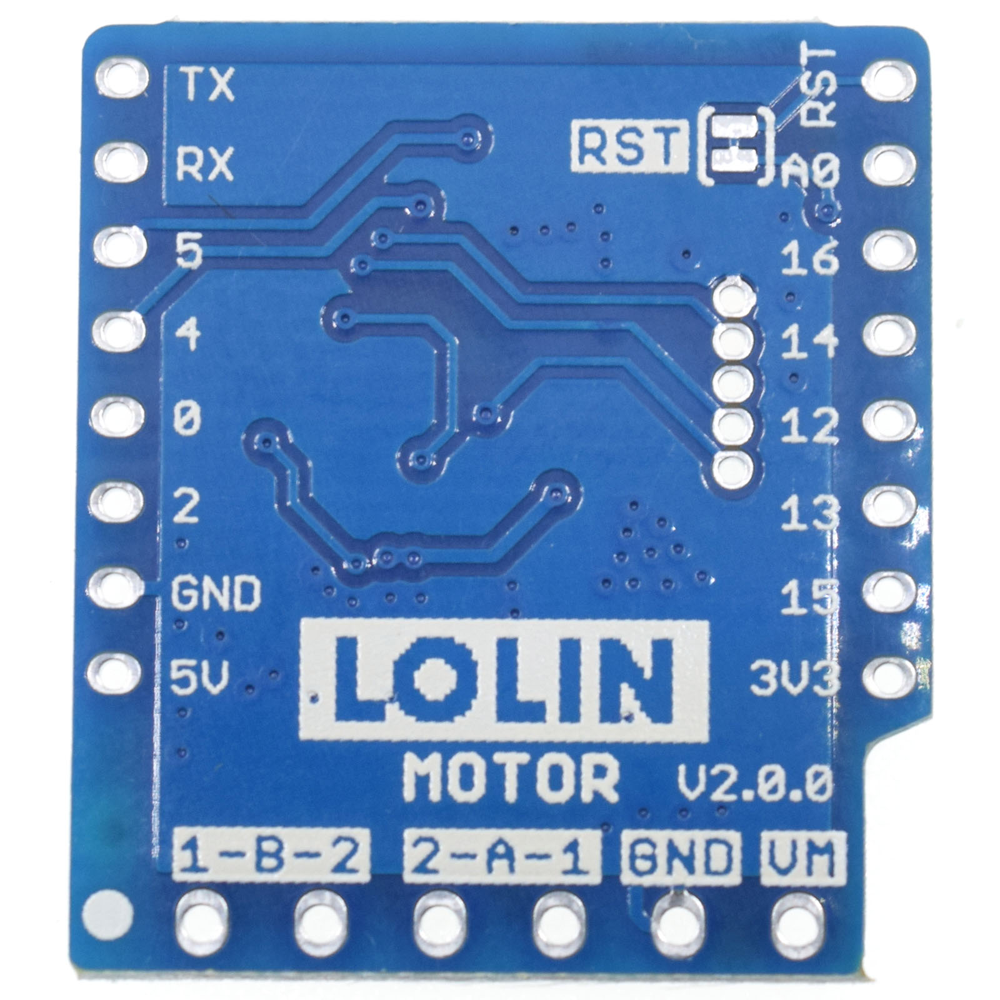

Motor Shield
===========================

==================  ==================  
 |TOP_IMG|_           |BOTTOM_IMG|_  
==================  ==================

.. |TOP_IMG| image:: ../_static/d1_shields/motor_v2.0.0_1_16x16.jpg
.. _TOP_IMG: ../_static/d1_shields/motor_v2.0.0_1_16x16.jpg

.. _BOTTOM_IMG: ../_static/d1_shields/motor_v2.0.0_2_16x16.jpg

I2C dual motor driver shield.
`[Buy it]`_

.. _[Buy it]: http://www.aliexpress.com/store/product/Motor-Shield-For-WeMos-D1-mini-I2C-Dual-Motor-Driver-TB6612FNG-1A-V1-0-0/1331105_32700182142.html

Features
---------------------

  * I2C interface
  * Power supply voltage: VM=15V max
  * Output current: Iout=1.2A(average) / 3.2A (peak)
  * Standby control to save power
  * CW/CCW/short brake/stop motor control modes

Pins
----------------------

===========    ===========    ===========
**D1 mini**    **GPIO**       **Shield**
D1             5              SCL
D2             4              SDA
RST            RST            RST
===========    ===========    ===========

  * **VM:** Motor power supply + (Max 15Vdc)
  * **GND:** Motor power supply -
  * **1-A-2:** Motor A
  * **2-B-1:** Motor B

Documents
-----------------------

  * `Schematic v2.0.0 [PDF]`_

.. _Schematic v2.0.0 [PDF]: ../_static/files/sch_motor_v2.0.0.pdf

Arduino
------------------------

  * Install `LOLIN_I2C_MOTOR_Library`_
  * `Arduino Examples`_

.. _LOLIN_I2C_MOTOR_Library: https://github.com/wemos/LOLIN_I2C_MOTOR_Library
.. _Arduino Examples: https://github.com/wemos/LOLIN_I2C_MOTOR_Library/tree/master/examples

   

