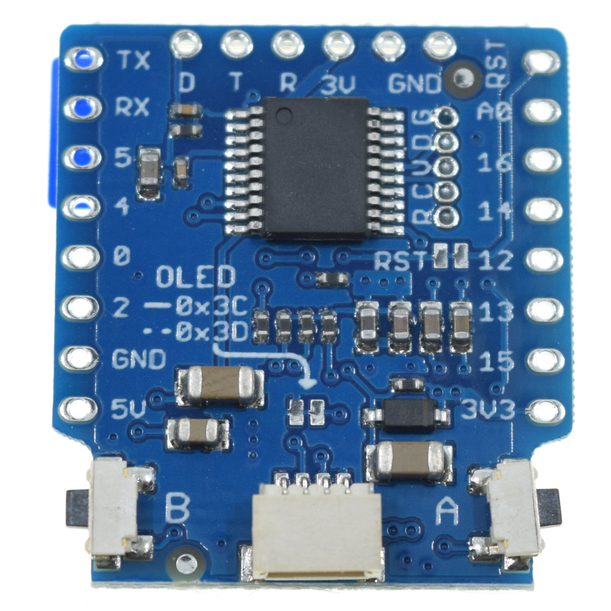

OLED 0.66 Shield
===========================

==================  ==================  
 |TOP_IMG|_           |BOTTOM_IMG|_  
==================  ==================

.. |TOP_IMG| image:: ../_static/d1_shields/oled_v2.1.0_1_16x16.jpg
.. _TOP_IMG: ../_static/d1_shields/oled_v2.1.0_1_16x16.jpg

.. _BOTTOM_IMG: ../_static/d1_shields/oled_v2.1.0_2_16x16.jpg

64×48 pixels (0.66” Across) OLED Shield with 2x I2C Button
`[Buy it]`_

.. _[Buy it]: http://www.aliexpress.com/store/product/OLED-Shield-for-WeMos-D1-mini-0-66-inch-64X48-IIC-I2C/1331105_32627787079.html

Features
---------------------

  * **Screen Size:** 64x48 pixels (0.66” Across)
  * **Operating Voltage:** 3.3V
  * **Driver IC:** SSD1306 (I2C Address: 0x3C or 0x3D)
  * 2x I2C Button (customizable I2C Address, default:0x31)

Pins
-----------------------

===========    ===========    ===========
**D1 mini**    **GPIO**       **Shield**
D1             5              SCL
D2             4              SDA
===========    ===========    ===========

Documents
-----------------------

  * `Schematic v2.1.0 [PDF]`_

.. _Schematic v2.1.0 [PDF]: ../_static/files/sch_oled_v2.1.0.pdf

Arduino
------------------------

  * Install `Adafruit_SSD1306_Library`_ (Add support by `@mcauser`_)
  * Install `LOLIN I2C Button library`_
  * `Arduino Examples`_

.. _Adafruit_SSD1306_Library: https://github.com/mcauser/Adafruit_SSD1306/tree/esp8266-64x48
.. _LOLIN I2C Button library: https://github.com/wemos/LOLIN_OLED_I2C_Button_Library
.. _Arduino Examples: https://github.com/wemos/LOLIN_OLED_I2C_Button_Library/tree/master/examples
.. _@mcauser: https://github.com/mcauser

   

