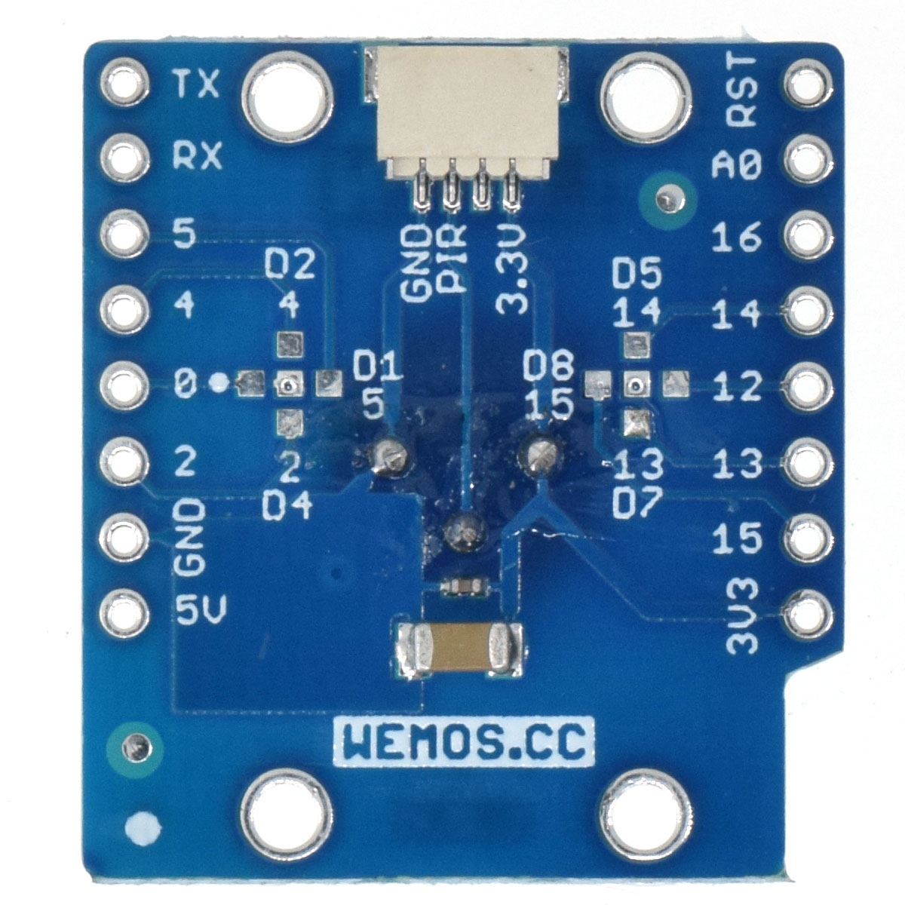

PIR Shield
===========================

==================  ==================  
 |TOP_IMG|_           |BOTTOM_IMG|_  
==================  ==================

.. |TOP_IMG| image:: ../_static/d1_shields/pir_v1.0.0_1_16x16.jpg
.. _TOP_IMG: ../_static/d1_shields/pir_v1.0.0_1_16x16.jpg

.. _BOTTOM_IMG: ../_static/d1_shields/pir_v1.0.0_2_16x16.jpg

Passive infrared sensor shield.
`[Buy it]`_

.. _[Buy it]: https://www.aliexpress.com/store/product/PIR-Shield-V1-0-0-for-LOLIN-D1-mini-passive-infrared-sensor-module/1331105_32901521233.html

Features
---------------------

  * Configurable IO (Default: D3/GPIO0)
  * Φ2mm mounting holes

Pins
----------------------

===========    ===========    ===========
**D1 mini**    **GPIO**       **Shield**
D3             0              PIR
===========    ===========    ===========

Documents
-----------------------

  * `Schematic v1.0.0 [PDF]`_
  * `Dimension v1.0.0 [JPG]`_

.. _Schematic v1.0.0 [PDF]: ../_static/files/sch_pir_v1.0.0.pdf
.. _Dimension v1.0.0 [JPG]: ../_static/files/dim_pir_v1.0.0.jpg

Arduino
------------------------

  * `Arduino Examples`_

.. _Arduino Examples: https://github.com/wemos/D1_mini_Examples/tree/master/examples/04.Shields/PIR_Shield

   

