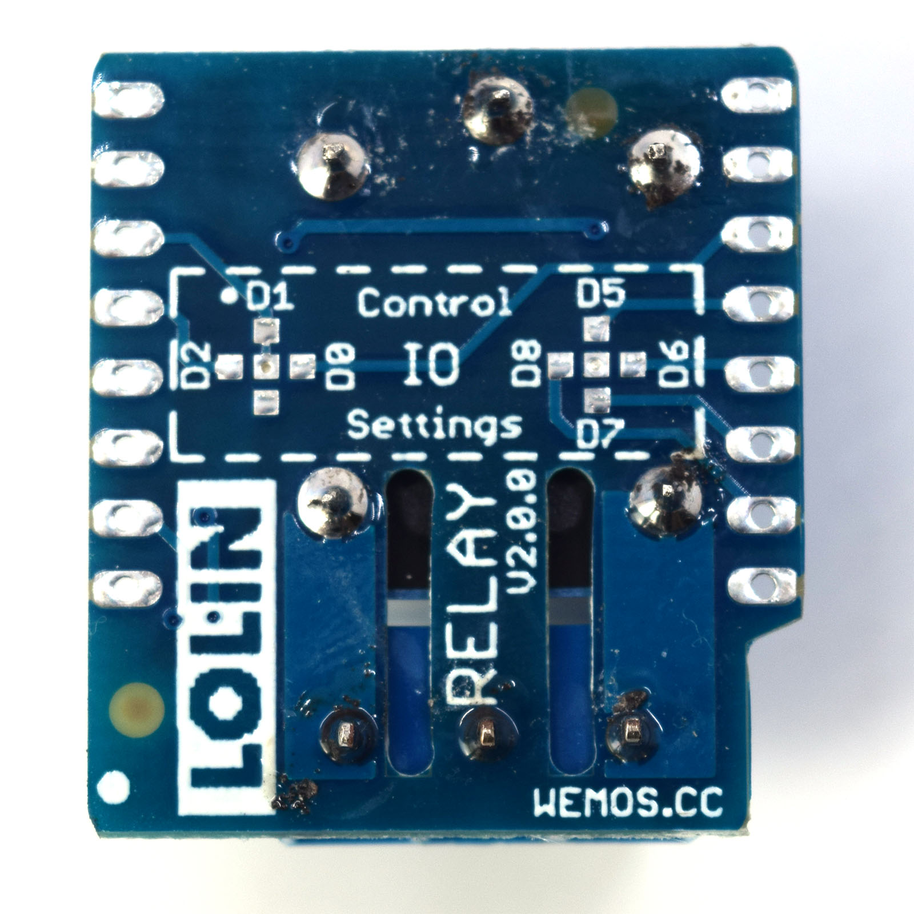

Relay Shield
===========================

==================  ==================  
 |TOP_IMG|_           |BOTTOM_IMG|_  
==================  ==================

.. |TOP_IMG| image:: ../_static/d1_shields/relay_v2.0.0_1_16x16.jpg
.. _TOP_IMG: ../_static/d1_shields/relay_v2.0.0_1_16x16.jpg

.. _BOTTOM_IMG: ../_static/d1_shields/relay_v2.0.0_2_16x16.jpg

Simple relay shield.
`[Buy it]`_

.. _[Buy it]: http://www.aliexpress.com/store/product/Relay-Shield-for-WeMos-D1-mini-button/1331105_32596395175.html

Features
---------------------

  * **NO:** 5A(250VAC/30VDC), 10A(125VAC), MAX:1250VA/150W
  * **NC:** 3A(250VAC/30VDC), MAX:750VA/90W
  * 7 configurable IO, default: D1(GPIO5)

Pins
----------------------

===========    ===========    ===========
**D1 mini**    **GPIO**       **Shield**
D1             5              RELAY
===========    ===========    ===========

Documents
-----------------------

  * `Schematic v2.0.0 [PDF]`_

.. _Schematic v2.0.0 [PDF]: ../_static/files/sch_relay_v2.0.0.pdf

Arduino
------------------------

  * `Arduino Examples`_

.. _Arduino Examples: https://github.com/wemos/D1_mini_Examples/tree/master/examples/04.Shields/Relay_Shield

   

