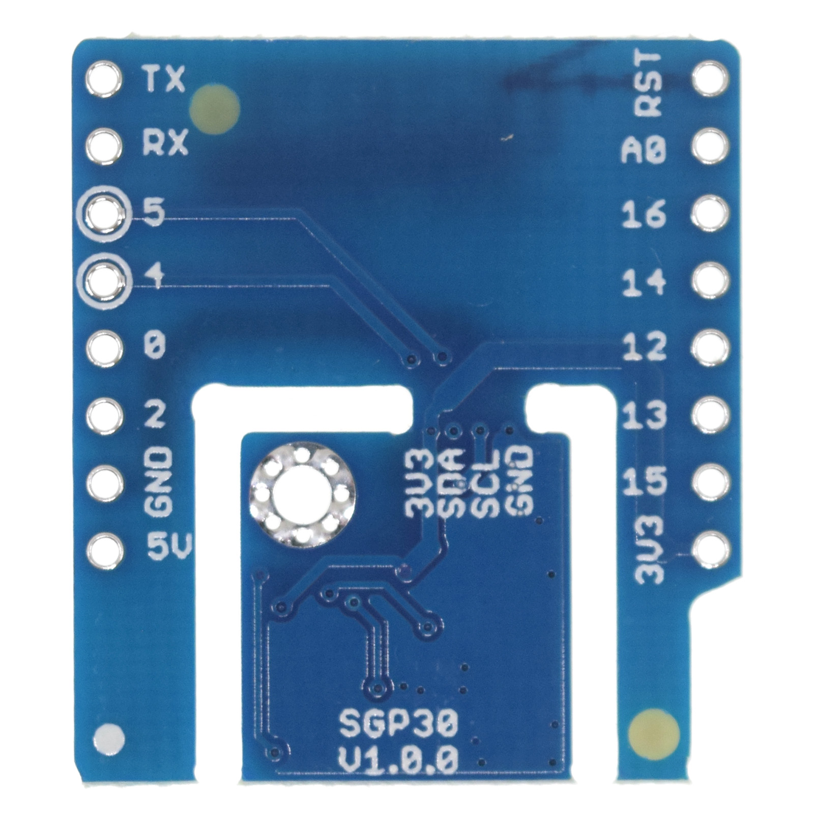

SGP30 Shield
===========================

==================  ==================  
 |TOP_IMG|_           |BOTTOM_IMG|_  
==================  ==================

.. |TOP_IMG| image:: ../_static/d1_shields/sgp30_v1.0.0_1_16x16.jpg
.. _TOP_IMG: ../_static/d1_shields/sgp30_v1.0.0_1_16x16.jpg

.. _BOTTOM_IMG: ../_static/d1_shields/sgp30_v1.0.0_2_16x16.jpg

I2C Interface TVOC and eCO2 sensor shield based SGP30.
`[Buy it]`_

.. _[Buy it]: https://www.aliexpress.com/item/4000575428246.html

Features
---------------------

  * I2C Interface
  * I2C Interface
  * TVOC: 0-60000 ppb
  * eCO2: 400-60000 ppm
  * Separable design
  * Φ2mm mounting holes

Pins
----------------------

===========    ===========    ===========
**D1 mini**    **GPIO**       **Shield**
D1             5              SCL
D2             4              SDA
===========    ===========    ===========

Documents
-----------------------

  * `Schematic v1.0.0 [PDF]`_
  * `SGP30 Datasheet [PDF]`_

.. _Schematic v1.0.0 [PDF]: ../_static/files/sch_sgp30_v1.0.0.pdf
.. _SGP30 Datasheet [PDF]: https://www.sensirion.com/file/datasheet_sgp30/

Arduino
------------------------

  * Install `Adafruit_SGP30`_
  * `Arduino Examples`_

.. _Adafruit_SGP30: https://github.com/adafruit/Adafruit_SGP30
.. _Arduino Examples: https://github.com/wemos/D1_mini_Examples/tree/master/examples/04.Shields/SGP30_Shield

   

