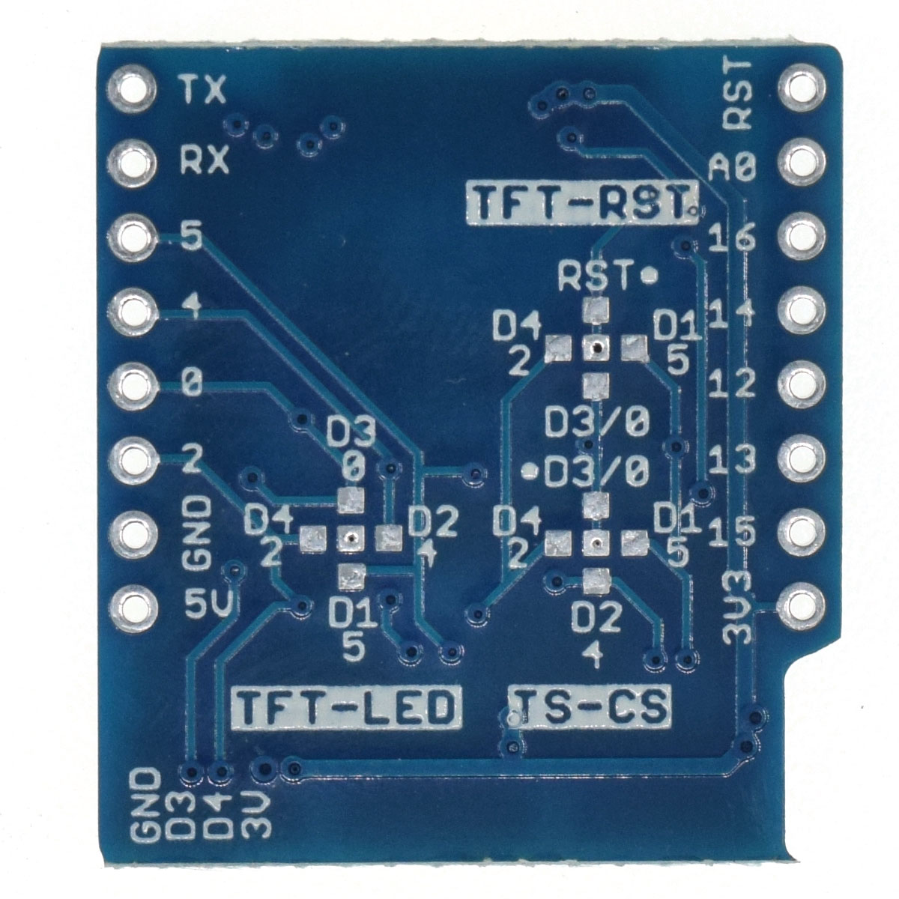

TFT I2C Connector Shield
===========================

==================  ==================  
 |TOP_IMG|_           |BOTTOM_IMG|_  
==================  ==================

.. |TOP_IMG| image:: ../_static/d1_shields/tft_i2c_con_v1.1.0_1_16x16.jpg
.. _TOP_IMG: ../_static/d1_shields/tft_i2c_con_v1.1.0_1_16x16.jpg

.. _BOTTOM_IMG: ../_static/d1_shields/tft_i2c_con_v1.1.0_2_16x16.jpg

1x TFT, 2x I2C & 1x User IO Connector
`[Buy it]`_

.. _[Buy it]: https://www.aliexpress.com/item/32846977179.html

Pins
----------------------

.. image:: ../_static/d1_shields/tft_i2c_con_v1.1.0_3_16x9.jpg
   :target: ../_static/d1_shields/tft_i2c_con_v1.1.0_3_16x9.jpg

TFT Connector
##################

===  =========  ===============================================
1    TFT_LED    Backlight control pin, default: NC
2    GND
3    TFT_RST    TFT RESET pin, default: RST
4    TFT_DC     TFT Register select pin, default: D8 (IO15)
5    MOSI       SPI MOSI, D7 (IO13)
6    MISO       SPI MISO, D6 (IO12)
7    SCK        SPI SCK, D5 (IO14)
8    3V3
9    TFT_CS     TFT Select pin, default: D0 (IO16)
10   TS_CS      Touch Screen Select pin, default: D3 (IO0)
===  =========  ===============================================

I2C Connector
#################

===  =====  ==========
1    3V3
2    SCL    D1 (IO5)
3    SDA    D2 (IO4)
4    GND
===  =====  ==========

User IO Connector
#####################

===  ==========
1    3V3
2    D4 (IO2)
3    D3 (IO0)
4    GND
===  ==========   

