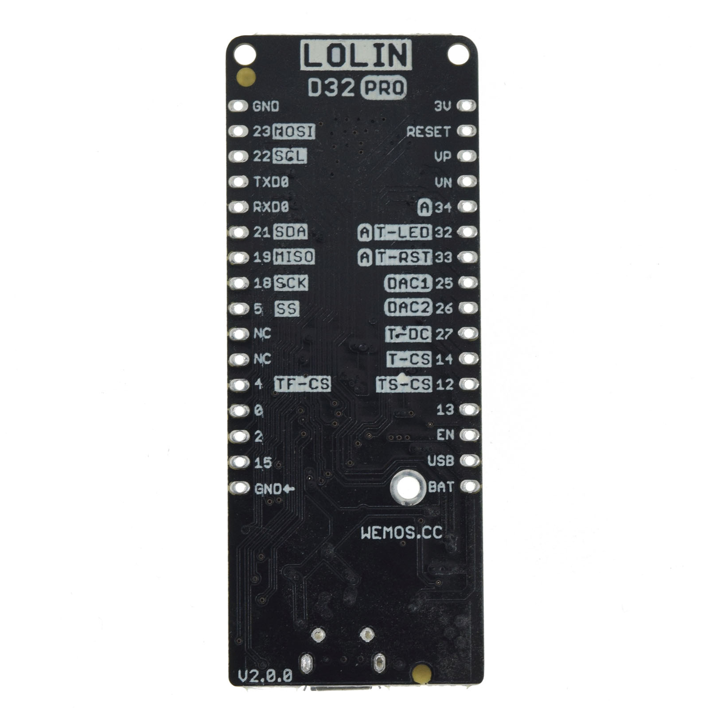
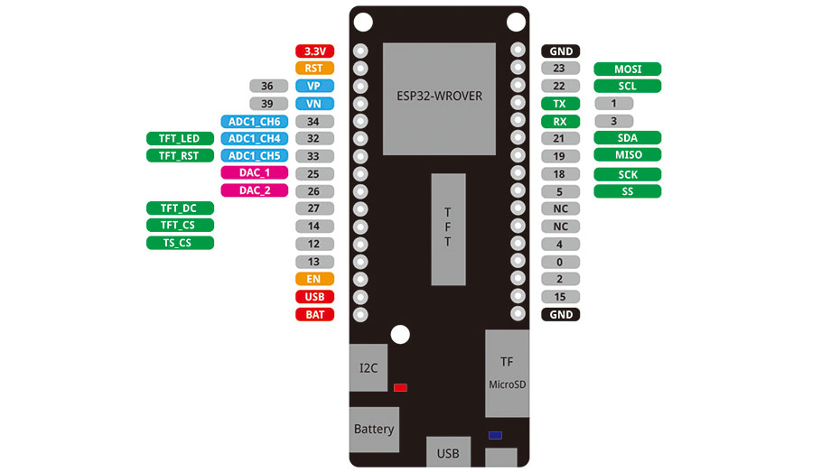

D32 Pro
================

==================  ==================  
 |TOP_IMG|_           |BOTTOM_IMG|_  
==================  ==================

.. |TOP_IMG| image:: ../_static/boards/d32_pro_v2.0.0_1_16x16.jpg
.. _TOP_IMG: ../_static/boards/d32_pro_v2.0.0_1_16x16.jpg

.. _BOTTOM_IMG: ../_static/boards/d32_pro_v2.0.0_2_16x16.jpg

A wifi&bluetooth board based ESP32-WROVER
`[Buy it] <https://www.aliexpress.com/store/product/LOLIN-D32-Pro-V1-0-0-wifi-bluetooth-board-based-ESP-32-esp32-Rev1-ESP32-WROVER/1331105_32883116057.html>`_

Features
------------------

  * Espressif official ESP32-WROVER module
  * Lastest ESP32 Version: REV1
  * 16MB FLASH
  * 8MB PSRAM 
  * Lithium battery interface, 500mA Max charging current
  * LOLIN I2C port
  * LOLIN TFT port
  * TF (Micro SD) Card slot, support SPI mode.  
  * Compatible with Arduino, MicroPython
  * Default firmware: lastest MicroPython

Tutorials
----------------------
  * :doc:`../tutorials/d32/get_started_with_micropython_d32`
  * :doc:`../tutorials/d32/get_started_with_arduino_d32`

Documentation
----------------------
  * `Schematic V2.0.0[PDF] <../_static/files/sch_d32_pro_v2.0.0.pdf>`_
  * `Dimension V2.0.0[PDF] <../_static/files/dim_d32_pro_v2.0.0.pdf>`_
  * :doc:`../ch340_driver`

Technical specs
----------------------
+------------------------+----------------------------+
| Operating Voltage      | 3.3V                       |
+------------------------+----------------------------+
| Supported Battery      | Lipo 3.7V                  |
+------------------------+----------------------------+
| Battery Connector      | PH-2 2.0mm                 |
+------------------------+----------------------------+
| Digital I/O Pins       | 22                         |
+------------------------+----------------------------+
| Analog Input Pins      | 6 (VP, VN, 32, 33, 34, 35) |
+------------------------+----------------------------+
| Analog Output Pins     | 2 (25, 26)                 |
+------------------------+----------------------------+
| LED_BUILTIN            | GPIO5                      |
+------------------------+----------------------------+
| Clock Speed(Max)       | 240MHz                     |
+------------------------+----------------------------+
| Flash                  | 16M/4M Bytes               |
+------------------------+----------------------------+
| PSRAM                  | 4M Bytes                   |
+------------------------+----------------------------+
| Size                   | 65*25.4mm                  |
+------------------------+----------------------------+
| Weight                 | 7.5g                       |
+------------------------+----------------------------+

Pin
----------------------

.. note:: All of the IO pins run at 3.3V.

