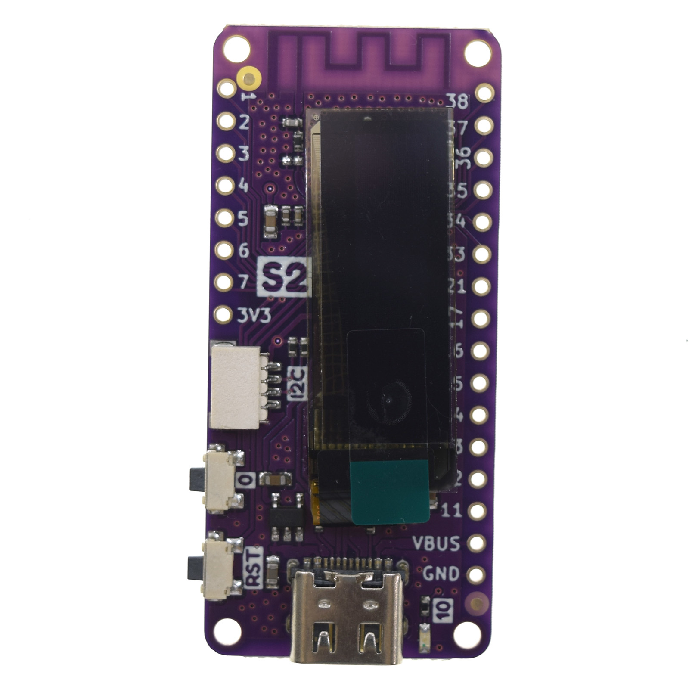
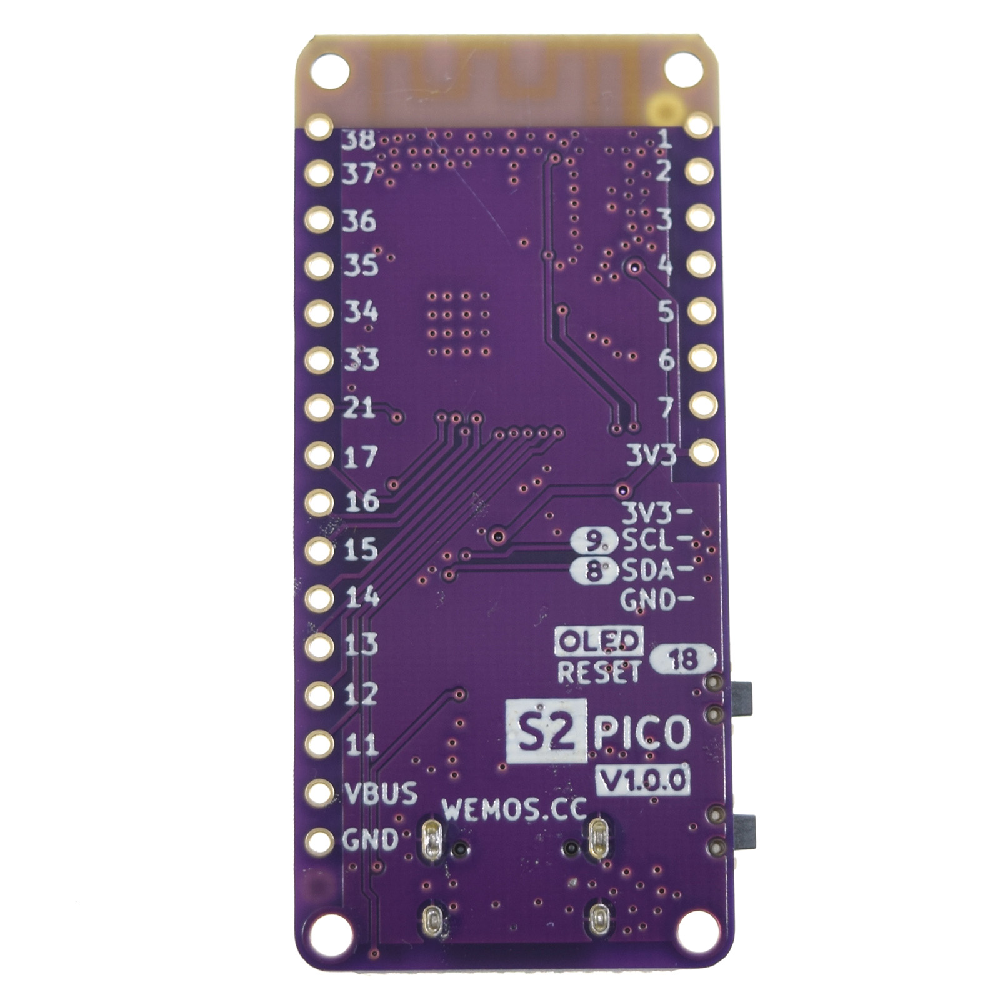
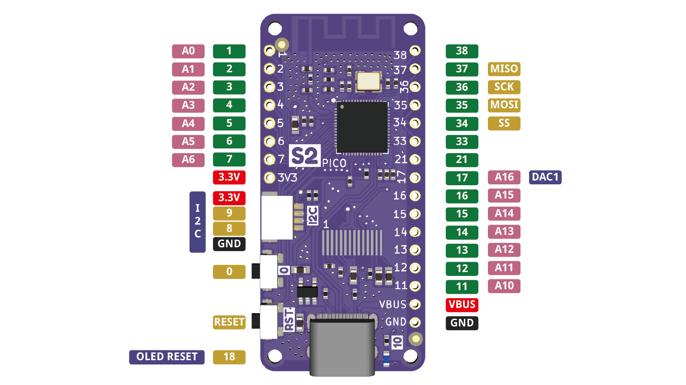

S2 Pico
================

==================  ==================  
 |TOP_IMG|_           |BOTTOM_IMG|_  
==================  ==================

.. _TOP_IMG: ../_static/boards/s2_pico_v1.0.0_1_16x16.jpg

.. _BOTTOM_IMG: ../_static/boards/s2_pico_v1.0.0_2_16x16.jpg

A mini wifi boards with OLED based ESP32-S2FN4R2. 
`[Buy it]`_

.. _[Buy it]: https://www.aliexpress.com/item/1005003215673294.html

Features
------------------
* based ESP32-S2FN4R2 WIFI IC
* 128x32 OLED (SSD1306 driver)
* Type-C USB
* 4MB Flash
* 2MB PSRAM 
* 21x IO
* ADC, DAC, I2C, SPI, UART, USB OTG
* Compatible with CircuitPython, MicroPython, Arduino and ESP-IDF
* Default firmware: MicroPython

Tutorials
----------------------

* :doc:`../tutorials/s2/get_started_with_micropython_s2`
* :doc:`../tutorials/s2/get_started_with_arduino_s2`

Documentation
----------------------

* `Schematic V1.0.0[PDF] <../_static/files/sch_s2_pico_v1.0.0.pdf>`_
* `Dimension V1.0.0[PDF] <../_static/files/dim_s2_pico_v1.0.0.pdf>`_
* `ESP32-S2 Datasheet <https://www.espressif.com/sites/default/files/documentation/esp32-s2_datasheet_en.pdf>`_

Technical specs
----------------------

+----------------------+------------+
| Operating Voltage    | 3.3V       |
+----------------------+------------+
| Digital I/O Pins     | 21         |
+----------------------+------------+
| Clock Speed          | 240MHz     |
+----------------------+------------+
| Flash                | 4M Bytes   |
+----------------------+------------+
| PSRAM                | 2M Bytes   |
+----------------------+------------+
| Size                 | 50*23mm    |
+----------------------+------------+
| Weight               | 3.8g       |
+----------------------+------------+

Pin
----------------------

