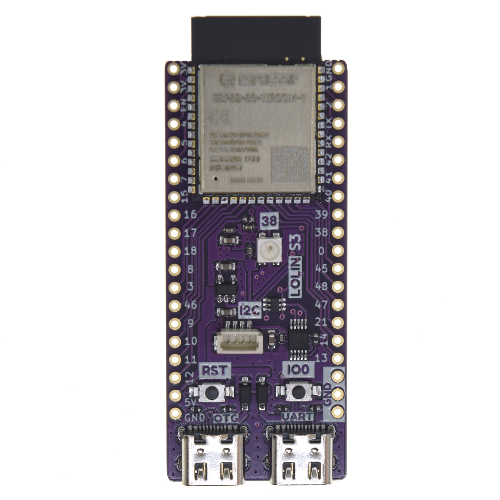
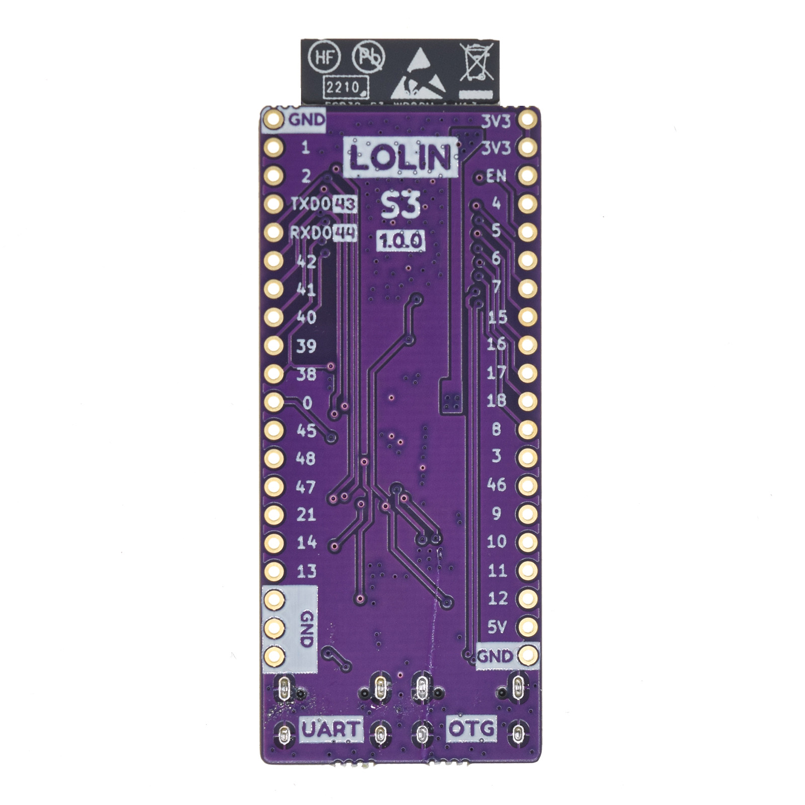
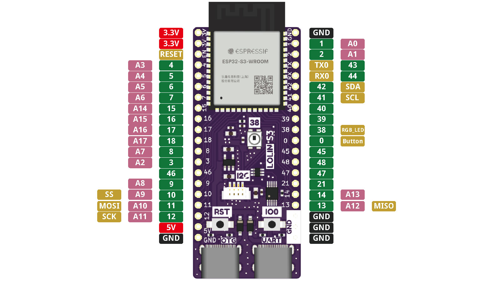

S3
================

==================  ==================  
 |TOP_IMG|_           |BOTTOM_IMG|_  
==================  ==================

.. _TOP_IMG: ../_static/boards/s3_v1.0.0_1_16x16.jpg

.. _BOTTOM_IMG: ../_static/boards/s3_v1.0.0_2_16x16.jpg

WiFi & Bluetooth 5 (LE) boards based ESP32-S3-WROOM-1. 
`[Buy it]`_

.. _[Buy it]: https://www.aliexpress.com/item/1005004643475363.html

Features
------------------
* based ESP32-S3-WROOM-1
* 2x Type-C USB (OTG, UART)
* 16MB Flash (Quad SPI)
* 8MB PSRAM (Octal SPI)
* 31x IO
* 1x LOLIN I2C Port
* ADC, DAC, I2C, SPI, UART, USB OTG
* Compatible with MicroPython, Arduino and ESP-IDF
* Default firmware: MicroPython

Tutorials
----------------------

* :doc:`../tutorials/s3/get_started_with_micropython_s3`
* :doc:`../tutorials/s3/get_started_with_arduino_s3`

Documentation
----------------------

* `Schematic V1.0.0[PDF] <../_static/files/sch_s3_v1.0.0.pdf>`_
* `Dimension V1.0.0[PDF] <../_static/files/dim_s3_v1.0.0.pdf>`_
* `ESP32-S3-WROOM-1 Datasheet <https://www.espressif.com/sites/default/files/documentation/esp32-s3-wroom-1_wroom-1u_datasheet_en.pdf>`_

Technical specs
----------------------

+----------------------+------------+
| Operating Voltage    | 3.3V       |
+----------------------+------------+
| Digital I/O Pins     | 31         |
+----------------------+------------+
| Clock Speed          | 240MHz     |
+----------------------+------------+
| Flash                | 16M Bytes  |
+----------------------+------------+
| PSRAM                | 8M Bytes   |
+----------------------+------------+
| Size                 | 65.3*25.4mm|
+----------------------+------------+
| Weight               | 9.0g       |
+----------------------+------------+

Pin
----------------------

