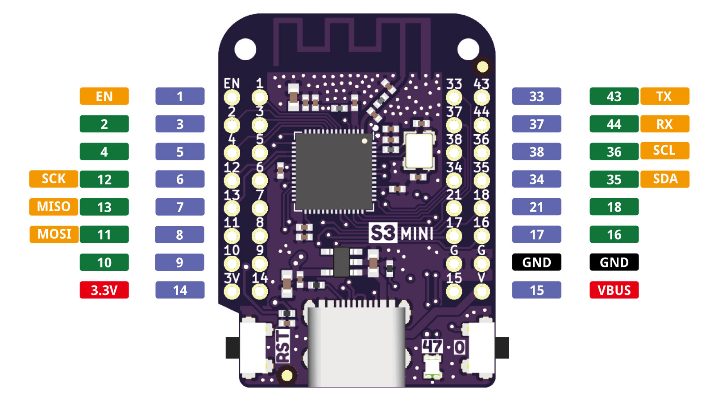

S3 MINI
================

==================  ==================  
 |TOP_IMG|_           |BOTTOM_IMG|_  
==================  ==================

.. |TOP_IMG| image:: ../_static/boards/s3_mini_v1.0.0_1_16x16.jpg
.. _TOP_IMG: ../_static/boards/s3_mini_v1.0.0_1_16x16.jpg

.. |BOTTOM_IMG| image:: ../_static/boards/s3_mini_v1.0.0_2_16x16.jpg
.. _BOTTOM_IMG: ../_static/boards/s3_mini_v1.0.0_2_16x16.jpg

WiFi & Bluetooth 5 (LE) boards based ESP32-S3FH4R2. 
`[Buy it]`_

.. _[Buy it]: https://www.aliexpress.com/item/1005004931357085.html

Features
------------------
* based ESP32-S3-WROOM-1
* 4MB Flash
* 2MB PSRAM
* 27x IO
* 1x RGB LED (IO47)
* ADC, DAC, I2C, SPI, UART, USB OTG
* Compatible with MicroPython, Arduino and ESP-IDF
* Default firmware: MicroPython

Tutorials
----------------------

* :doc:`../tutorials/s3/get_started_with_micropython_s3`
* :doc:`../tutorials/s3/get_started_with_arduino_s3`

Documentation
----------------------

* `Schematic V1.0.0[PDF] <../_static/files/sch_s3_mini_v1.0.0.pdf>`_
* `Dimension V1.0.0[PDF] <../_static/files/dim_s3_mini_v1.0.0.pdf>`_
* `ESP32-S3 Datasheet <https://www.espressif.com/sites/default/files/documentation/esp32-s3_datasheet_en.pdf>`_

Technical specs
----------------------

+----------------------+------------+
| Operating Voltage    | 3.3V       |
+----------------------+------------+
| Digital I/O Pins     | 27         |
+----------------------+------------+
| Clock Speed          | 240MHz     |
+----------------------+------------+
| Flash                | 4M Bytes   |
+----------------------+------------+
| PSRAM                | 2M Bytes   |
+----------------------+------------+
| Size                 | 34.3*25.4mm|
+----------------------+------------+
| Weight               | 4g         |
+----------------------+------------+

Pin
----------------------

