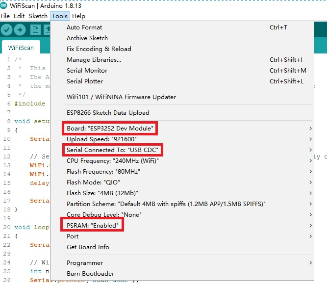

Get started with Arduino [S2 series]
==================================================

Requirements
---------------
  * `Python <https://www.python.org/downloads/>`_
  * `Arduino IDE <https://www.arduino.cc/>`_

Installing Hardware package
-----------------------------
  * `esp32 package <https://github.com/espressif/arduino-esp32>`_ 

Configure Board
-------------------

Documentation
-------------------------
  * `ESP32-S2 and ESP32-C3 Support <https://github.com/espressif/arduino-esp32#esp32-s2-and-esp32-c3-support>`_

