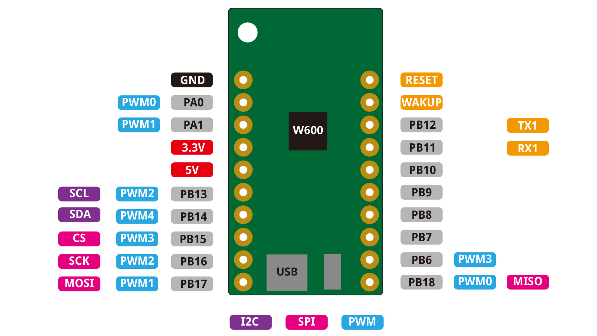

W600-PICO
================

.. ==================  ==================  
..  |TOP_IMG|_           |BOTTOM_IMG|_  
.. ==================  ==================

.. |TOP_IMG| image:: ../_static/boards/w600_pico_v1.0.0_1_16x16.jpg
.. _TOP_IMG: ../_static/boards/w600_pico_v1.0.0_1_16x16.jpg

.. |BOTTOM_IMG| image:: ../_static/boards/w600_pico_v1.0.0_2_16x16.jpg
.. _BOTTOM_IMG: ../_static/boards/w600_pico_v1.0.0_2_16x16.jpg

A mini wifi boards based W600. 

Features
------------------

Tutorials
----------------------
  * :doc:`../tutorials/w600/get_started_with_micropython_w600`

..   * :doc:`../tutorials/arduino`

Documentation
----------------------
  * `Schematic V1.0.0[PDF] <../_static/files/sch_w600_pico_v1.0.0.pdf>`_
  * `Dimension V1.0.0[PDF] <../_static/files/dim_w600_pico_v1.0.0.pdf>`_
  * :doc:`../ch340_driver`

Technical specs
----------------------

+------------------------+------------+
| Operating Voltage      | 3.3V       |
+------------------------+------------+
| Digital I/O Pins       | 15         |
+------------------------+------------+
| Clock Speed            | 80MHz      |
+------------------------+------------+
| Flash                  | 1M Bytes   |
+------------------------+------------+
| Size                   | 33*20.3mm  |
+------------------------+------------+
| Weight                 | 3g         |
+------------------------+------------+

Pin
----------------------

